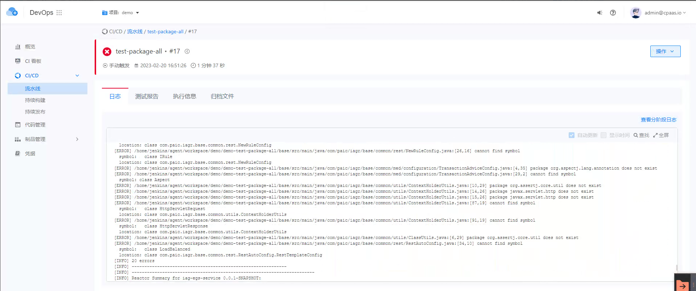

---
kind:
  - Troubleshooting
products:
  - Alauda Container Platform
  - Alauda DevOps
  - Alauda AI
  - Alauda Application Services
  - Alauda Service Mesh
  - Alauda Developer Portal
ProductsVersion:
  - 4.1.0,4.2.x
---
<!-- A type of document that involves encountering a fault, diagnosing it, performing root cause analysis, and providing solutions. -->

# 流水线报错cannot find symbol

java流水线编译失败，报错cannot find symbol，package org.xxx.xxx does not exist 首次执行无构建缓存，缺失依赖包导致报错 多个子项目均存在依赖包缺失问题，逐个添加依赖不现实

## Cause
- pom.xml中未声明需要使用的依赖包
- 构建节点本地仓库（local repository）缺少未在pom.xml声明的依赖包

## Resolution
- 将传统环境Jenkins localrepository路径内容归档并迁移到Jenkins slave使用的PVC中

## [workaround]

## [Related Information]
**Screenshots**

- Environment: TKE 3.10
- pom.xml
- mvn
- nexus仓库
- jenkins localrepository
- jenkins slave PVC
- Component: 流水线
- Page ID: 140807258
- Original Title: 流水线报错cannot find symbol
