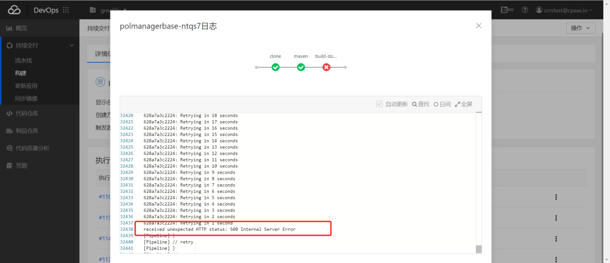

---
kind:
  - Troubleshooting
products:
  - Alauda Container Platform
  - Alauda DevOps
  - Alauda AI
  - Alauda Application Services
  - Alauda Service Mesh
  - Alauda Developer Portal
ProductsVersion:
  - 4.1.0,4.2.x
---
<!-- A type of document that involves encountering a fault, diagnosing it, performing root cause analysis, and providing solutions. -->

# 流水线构建镜像卡在build

流水线构建镜像卡在build阶段 push镜像报错500 harbor-database容器重启报错no space left on disk

## Cause
- harbor pvc使用的nfs存储磁盘空间使用100%

## Resolution
- 扩容harbor使用的磁盘

## [workaround]

## [Related Information]
**Screenshots**

- Environment: 3.6
- harbor-database
- nfs存储
- harbor pvc
- Component: 流水线
- Page ID: 140812775
- Original Title: 流水线构建镜像卡在build
