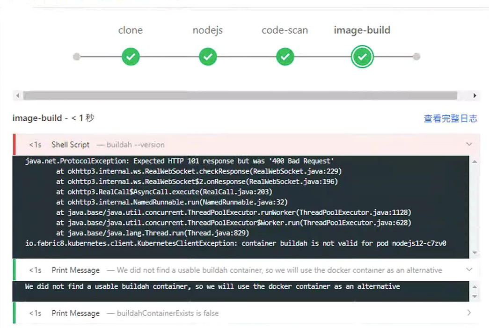
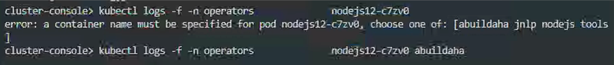
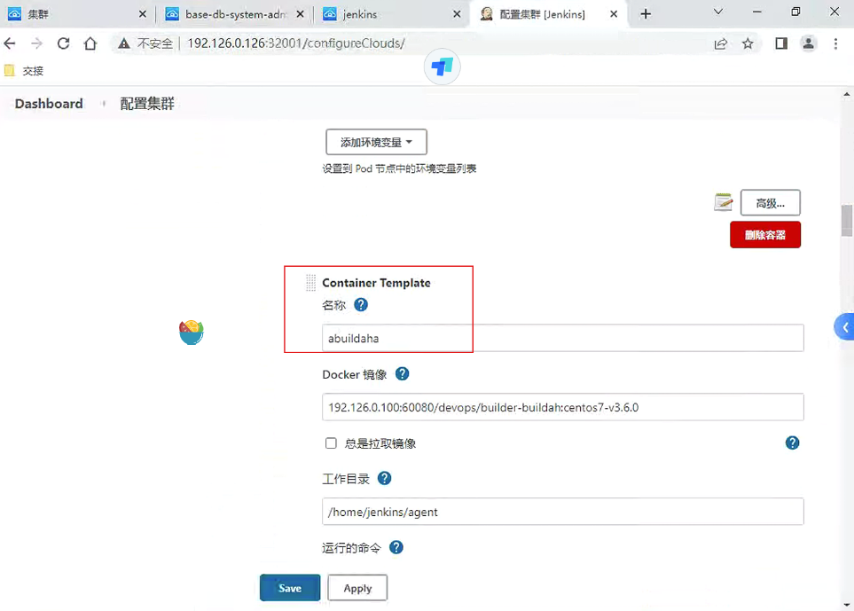
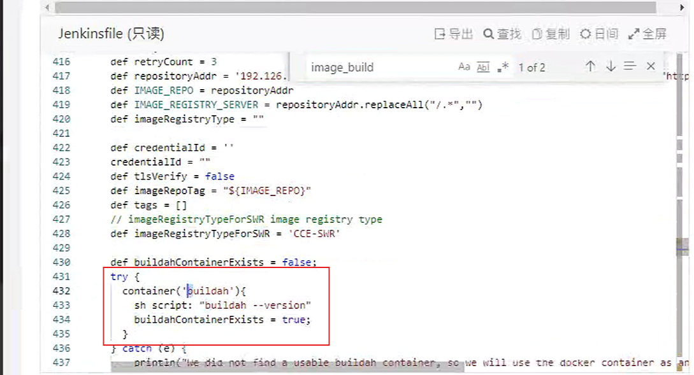

---
kind:
  - Troubleshooting
products:
  - Alauda Container Platform
  - Alauda DevOps
  - Alauda AI
  - Alauda Application Services
  - Alauda Service Mesh
  - Alauda Developer Portal
ProductsVersion:
  - 4.1.0,4.2.x
---
<!-- A type of document that involves encountering a fault, diagnosing it, performing root cause analysis, and providing solutions. -->

# 流水线执行失败，卡在构建镜像

流水线执行失败，卡在构建镜像步骤 日志报错找不到buildah容器 后台存在abuildaha容器而非buildah容器

## Cause
- Jenkins后台配置的构建节点名称(abuildaha)与Jenkinsfile中指定的agent名称(buildah)不匹配

## Resolution
- 修改Jenkins slave配置为buildah
- 重启Jenkins使配置生效

## [workaround]

## [Related Information]
**Screenshots**

- Environment: 3.6.2
- jenkins slave配置
- jenkinsfile agent名称
- buildah容器
- Component: 流水线
- Page ID: 140823427
- Original Title: 流水线执行失败，卡在构建镜像
