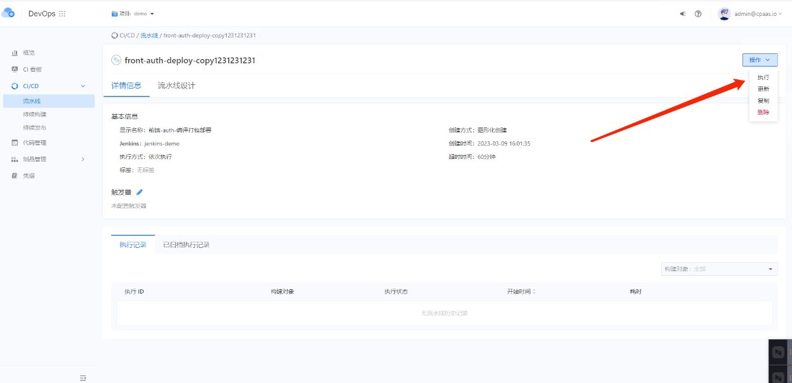

---
kind:
  - Troubleshooting
products:
  - Alauda Container Platform
  - Alauda DevOps
  - Alauda AI
  - Alauda Application Services
  - Alauda Service Mesh
  - Alauda Developer Portal
ProductsVersion:
  - 4.1.0,4.2.x
---
<!-- A type of document that involves encountering a fault, diagnosing it, performing root cause analysis, and providing solutions. -->

# devops流水线点击执行没有反应

ui点击执行没有反应接口无报错 复制流水线创建会报错500 devops-api无报错日志开启debug发现请求都是200

## Cause
- global节点单点部署
- global节点根磁盘空间占满导致容器异常

## Resolution
- 清理global节点磁盘空间
- 重启异常容器

## [workaround]

## [Related Information]
**Screenshots**

- Environment: 3.8.1
- global节点
- etcd
- devops-api
- Component: 流水线
- Page ID: 140824888
- Original Title: devops流水线点击执行没有反应
