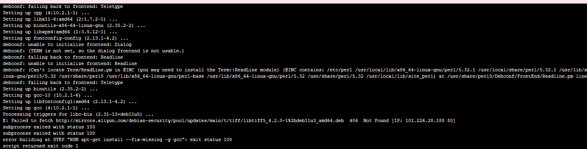
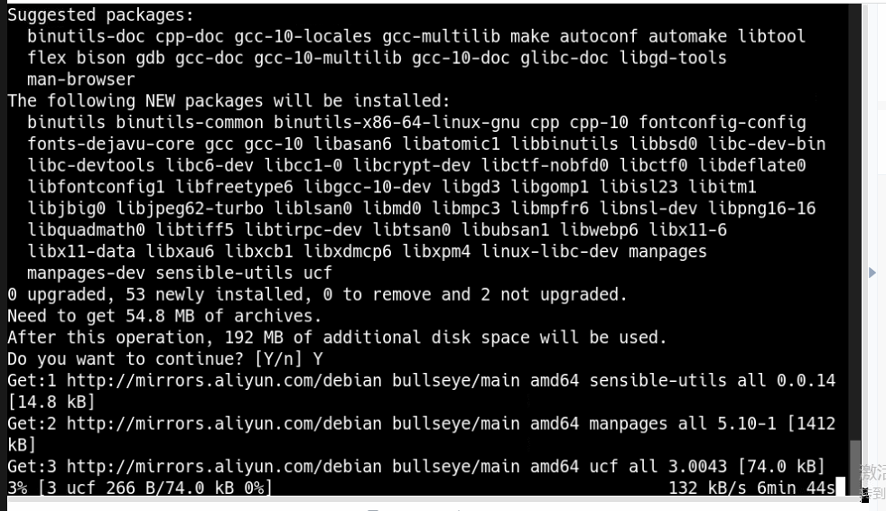

---
kind:
  - Troubleshooting
products:
  - Alauda Container Platform
  - Alauda DevOps
  - Alauda AI
  - Alauda Application Services
  - Alauda Service Mesh
  - Alauda Developer Portal
ProductsVersion:
  - 4.1.0,4.2.x
---
<!-- A type of document that involves encountering a fault, diagnosing it, performing root cause analysis, and providing solutions. -->

# 3.10.2

CICD打包python镜像报错gcc命令下载失败 使用阿里云镜像源下载速度较慢

## Cause
- dockerfile内使用的阿里云镜像源下载速度慢导致gcc安装失败

## Resolution
- 修改dockerfile内基础镜像的镜像源为清华大学/网易等国内镜像源

## [workaround]

## [Related Information]
**Screenshots**

- Environment: 3.10.2
- dockerfile
- apt-get镜像源配置
- gcc安装命令
- Component: Pipeline
- Page ID: 140825096
- Original Title: 3.10.2-DevOps-CICD打包python镜像报错安装gcc失败
