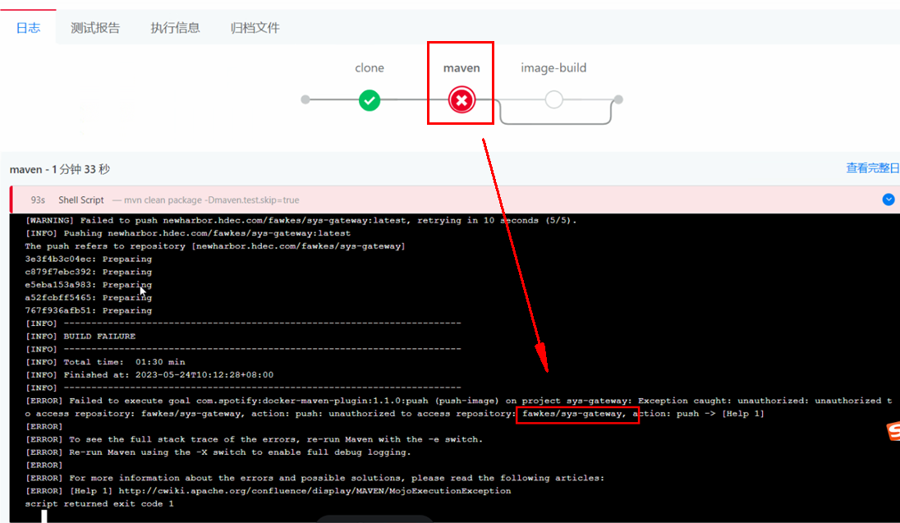
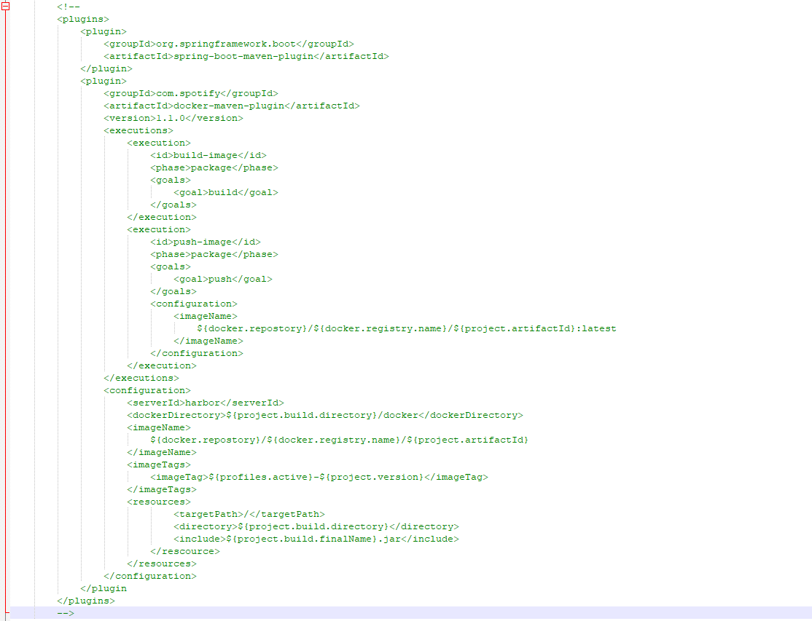

---
kind:
  - Troubleshooting
products:
  - Alauda Container Platform
  - Alauda DevOps
  - Alauda AI
  - Alauda Application Services
  - Alauda Service Mesh
  - Alauda Developer Portal
ProductsVersion:
  - 4.1.0,4.2.x
---
<!-- A type of document that involves encountering a fault, diagnosing it, performing root cause analysis, and providing solutions. -->

# 流水线maven阶段pom.xml内定义镜像构建上传动作

镜像删除失败

## Cause
- pom.xml自定义镜像构建/上传配置缺少凭证

## Resolution
- 注释pom.xml中镜像构建与上传配置

## [workaround]

## [Related Information]
**Screenshots**

- Environment: 通用
- pom.xml镜像构建配置
- pom.xml镜像上传配置
- Component: 流水线
- Page ID: 149586941
- Original Title: 流水线maven阶段pom.xml内定义镜像构建上传动作-因缺少凭证导致镜像删除失败
