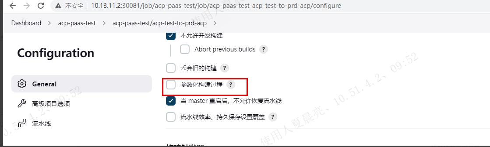
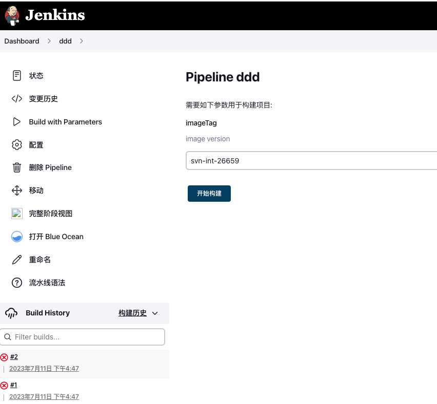

---
kind:
  - Troubleshooting
products:
  - Alauda Container Platform
  - Alauda DevOps
  - Alauda AI
  - Alauda Application Services
  - Alauda Service Mesh
  - Alauda Developer Portal
ProductsVersion:
  - 4.1.0,4.2.x
---
<!-- A type of document that involves encountering a fault, diagnosing it, performing root cause analysis, and providing solutions. -->

# 脚本流水线参数化构建弹窗不显示

脚本流水线参数化构建弹窗不显示 基于老流水线复制或新建流水线不显示参数化构建 新建简单流水线可正常显示参数化构建

## Cause
- 流水线包含复杂函数或内置option配置
- ACP控制器同步机制影响参数化构建显示

## Resolution
- 1. 新建简单流水线模板
2. 将旧流水线内容迁移至新模板

## [workaround]

## [Related Information]
**Screenshots**

- Environment: TKE 3.12
- jenkinsfile parameters
- option
- ACP控制器
- Component: 流水线
- Page ID: 152657714
- Original Title: 脚本流水线参数化构建弹窗不显示
