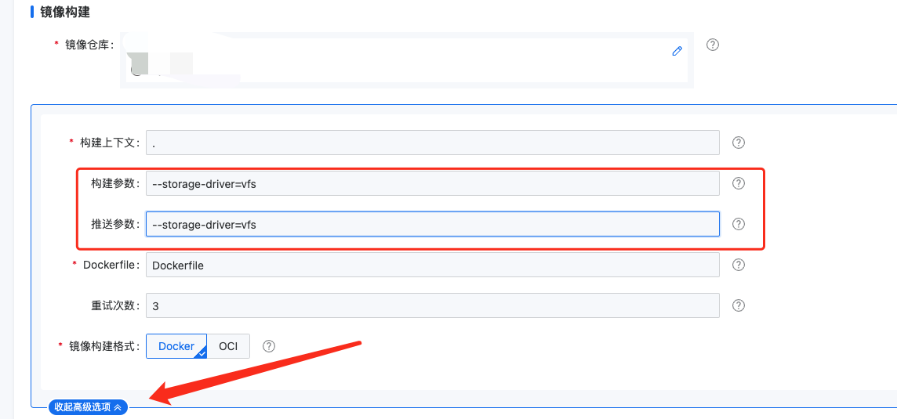

---
kind:
  - Troubleshooting
products:
  - Alauda Container Platform
  - Alauda DevOps
  - Alauda AI
  - Alauda Application Services
  - Alauda Service Mesh
  - Alauda Developer Portal
ProductsVersion:
  - 4.1.0,4.2.x
---
<!-- A type of document that involves encountering a fault, diagnosing it, performing root cause analysis, and providing solutions. -->

# buildah构建缓慢

buildah构建镜像时copy包过程缓慢，导致流水线执行时间长或失败

## Cause
- 默认使用fuse-overlayfs文件系统导致copy操作性能问题

## Resolution
- 构建参数添加--storage-driver=vfs
- 推送参数添加--storage-driver=vfs

## [workaround]

## [Related Information]
**Screenshots**

- Environment: 3.12.x及以上版本
- --storage-driver
- vfs
- fuse-overlayfs
- buildah构建参数
- 镜像推送参数
- Component: 流水线
- Page ID: 158797005
- Original Title: buildah构建缓慢-3.12.x版本处理方案
