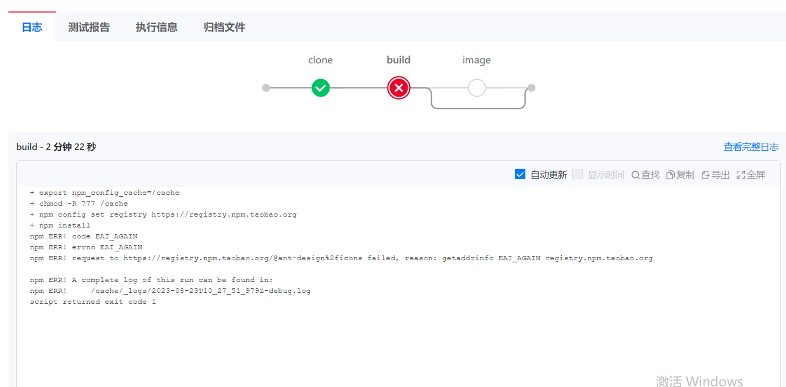

---
kind:
  - Troubleshooting
products:
  - Alauda Container Platform
  - Alauda DevOps
  - Alauda AI
  - Alauda Application Services
  - Alauda Service Mesh
  - Alauda Developer Portal
ProductsVersion:
  - 4.1.0,4.2.x
---
<!-- A type of document that involves encountering a fault, diagnosing it, performing root cause analysis, and providing solutions. -->

# 3.12

流水线build报错拉取依赖失败 容器内curl依赖地址不通 不同节点/etc/resolv.conf中nameserver不一致

## Cause
- coredns所在节点无法联通依赖地址
- 节点间DNS配置(nameserver)不一致

## Resolution
- 修改其他节点的/etc/resolv.conf与nodejs节点配置一致
- 重启coredns服务

## [workaround]

## [Related Information]
**Screenshots**

- Environment: 3.12+
- coredns
- nodejs容器
- /etc/resolv.conf
- nameserver
- Component: 流水线
- Page ID: 161385111
- Original Title: 3.12-流水线拉取依赖失败
