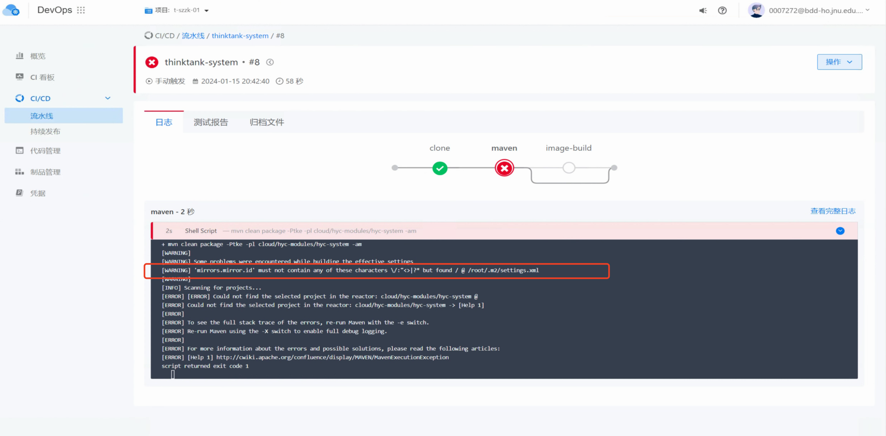

---
kind:
  - Troubleshooting
products:
  - Alauda Container Platform
  - Alauda DevOps
  - Alauda AI
  - Alauda Application Services
  - Alauda Service Mesh
  - Alauda Developer Portal
ProductsVersion:
  - 4.1.0,4.2.x
---
<!-- A type of document that involves encountering a fault, diagnosing it, performing root cause analysis, and providing solutions. -->

# 流水线mvn构建应用失败

流水线mvn构建应用失败，报错找不到项目模块

## Cause
- jenkins工作路径在workspace下两级目录（cloud文件夹）执行maven命令，未正确识别多模块项目的pom.xml结构

## Resolution
- 在构建脚本中先cd进入可执行maven命令的目录（如project/cloud/pom.xml所在目录）再进行构建

## [workaround]

## [Related Information]
**Screenshots**

- Environment: 3.8.1
- pom.xml文件路径
- maven settings.xml groupid配置
- jenkins workspace目录结构
- Component: 流水线
- Page ID: 196905180
- Original Title: Devops-流水线mvn构建应用失败
