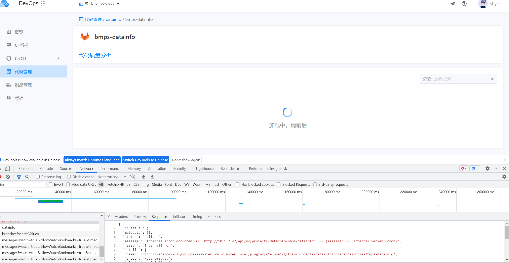

---
kind:
  - Troubleshooting
products:
  - Alauda Container Platform
  - Alauda DevOps
  - Alauda AI
  - Alauda Application Services
  - Alauda Service Mesh
  - Alauda Developer Portal
ProductsVersion:
  - 4.1.0,4.2.x
---
<!-- A type of document that involves encountering a fault, diagnosing it, performing root cause analysis, and providing solutions. -->

# 长城人寿

无法选择git分支 代码仓库报错500

## Cause
- 资源不足导致性能问题（处理41个外部gitlab项目时）

## Resolution
- 调整katanomi-plugin/api/controller的pod资源限制
- 增加集群资源

## [workaround]

## [Related Information]
**Screenshots**

- Environment: v3.8.1 外部gitlab集成环境，包含41个项目
- katanomi-plugin
- api
- controller
- gitlab集成
- 集群资源
- Component: 流水线
- Page ID: 202968317
- Original Title: Devops-长城人寿-创建流水线选择不到git分支
