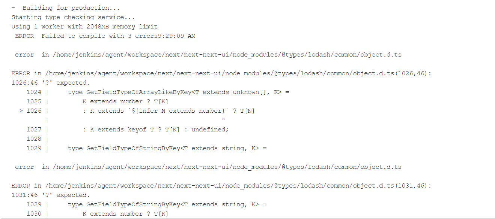
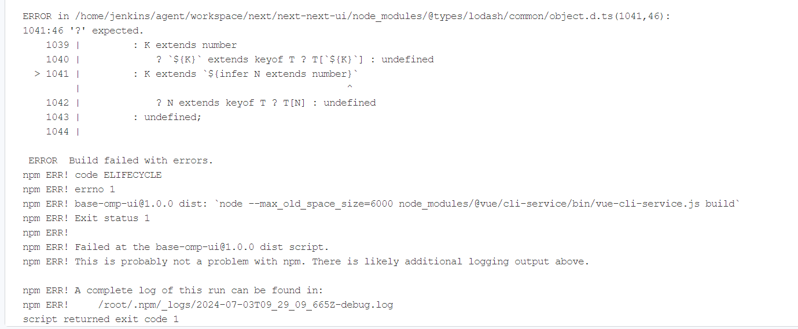
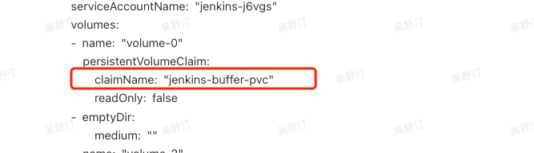

---
kind:
  - Troubleshooting
products:
  - Alauda Container Platform
  - Alauda DevOps
  - Alauda AI
  - Alauda Application Services
  - Alauda Service Mesh
  - Alauda Developer Portal
ProductsVersion:
  - 4.1.0,4.2.x
---
<!-- A type of document that involves encountering a fault, diagnosing it, performing root cause analysis, and providing solutions. -->

# nodejs 构建异常

构建异常 之前成功的commit id构建失败 语法检测错误

## Cause
- typescript包版本升级导致不兼容

## Resolution
- npm install typescript@latest @types/lodash@latest --registry=http://10.10.3.182:32010/repository/npm-group
- 检查依赖包版本兼容性

## [workaround]
- 更换nodejs缓存pvc

## [Related Information]
**Screenshots**

- Environment: 3.12.3
- typescript
- @types/lodash
- npm
- pvc
- http://10.10.3.182:32010/repository/npm-group
- Component: 流水线
- Page ID: 219090842
- Original Title: Devops-nodejs 构建异常
