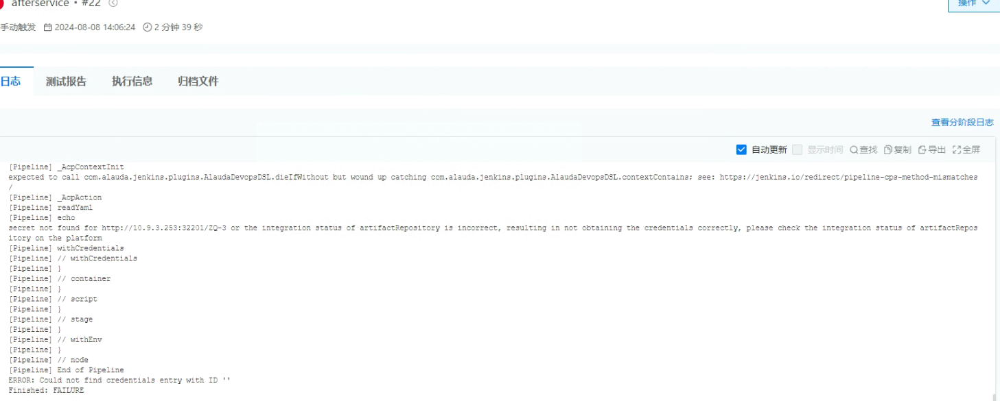
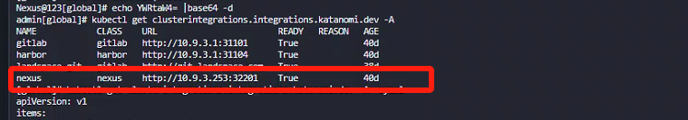
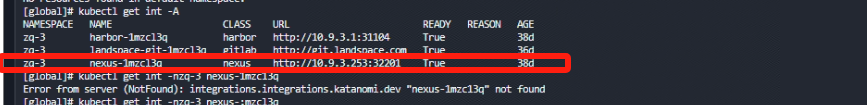
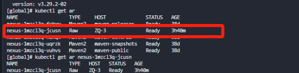
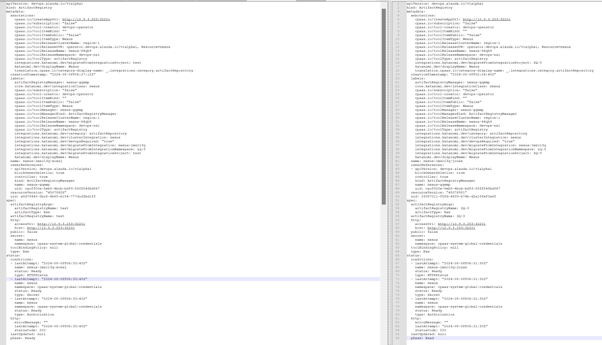

---
kind:
  - Troubleshooting
products:
  - Alauda Container Platform
  - Alauda DevOps
  - Alauda AI
  - Alauda Application Services
  - Alauda Service Mesh
  - Alauda Developer Portal
ProductsVersion:
  - 4.1.0,4.2.x
---
<!-- A type of document that involves encountering a fault, diagnosing it, performing root cause analysis, and providing solutions. -->

# 流水线执行失败

流水线执行失败-报错上传nexis无secret导致上传失败

## Cause
- nexus文件夹名称大写导致

## Resolution
- 重新创建小写名称的nexus文件夹，在平台侧进行授权使用，重新执行流水线

## [workaround]

## [Related Information]
**Screenshots**

- Environment: 3.16.1
- clusterintegration资源
- integration资源
- artifact registry资源
- Component: 流水线
- Page ID: 225970723
- Original Title: 流水线执行失败-报错上传nexis无secret导致上传失败（nexus文件夹名称大写导致）
