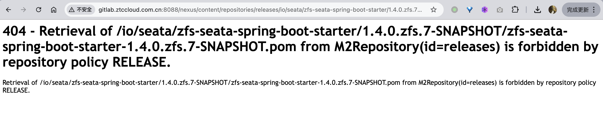
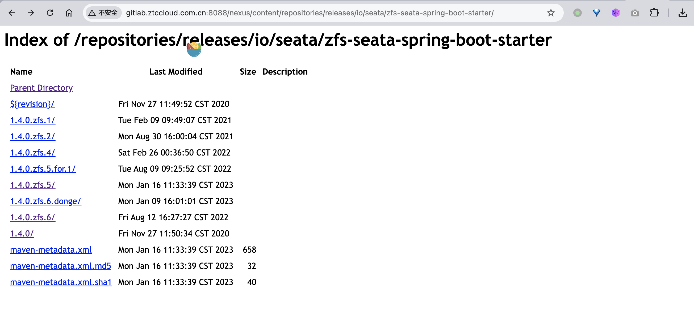
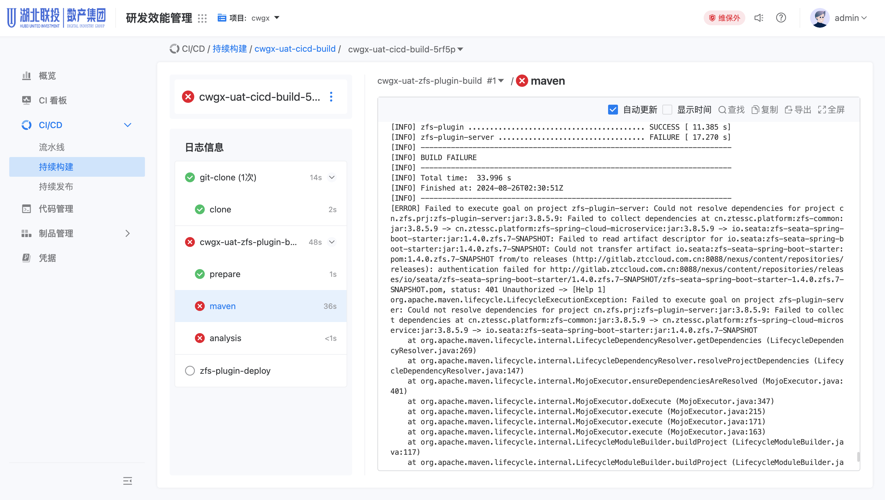
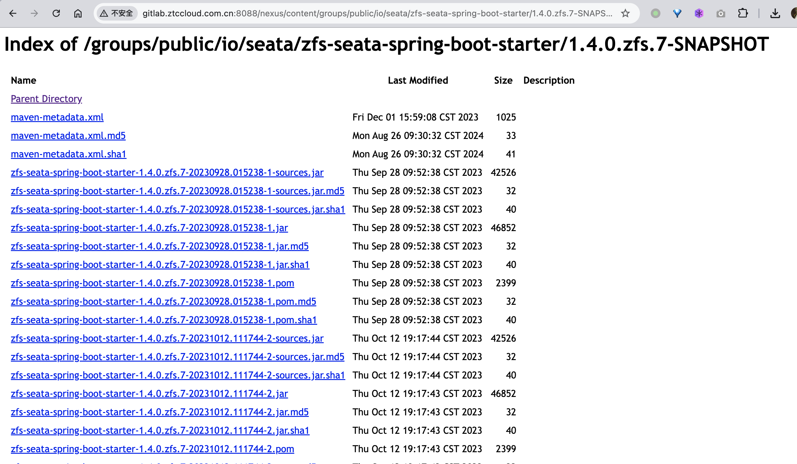
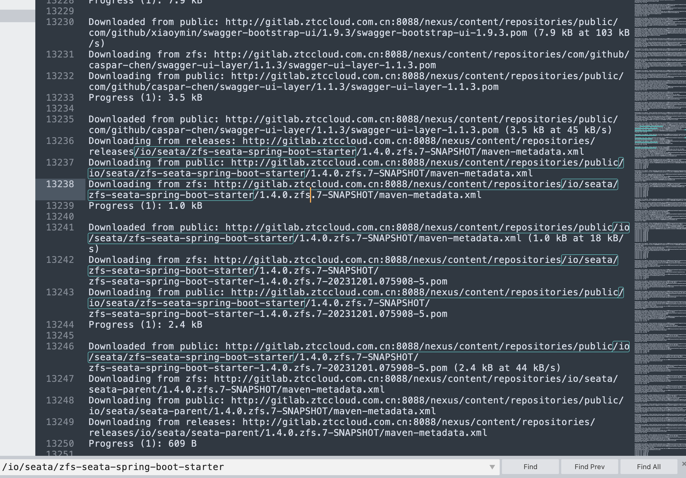
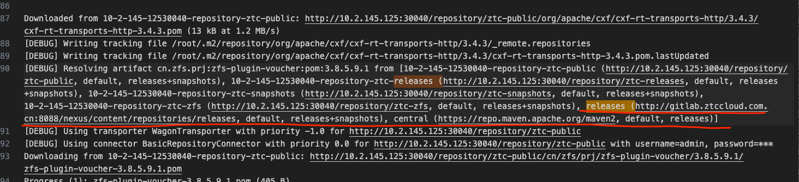

---
kind:
  - Troubleshooting
products:
  - Alauda Container Platform
  - Alauda DevOps
  - Alauda AI
  - Alauda Application Services
  - Alauda Service Mesh
  - Alauda Developer Portal
ProductsVersion:
  - 4.1.0,4.2.x
---
<!-- A type of document that involves encountering a fault, diagnosing it, performing root cause analysis, and providing solutions. -->

# 流水线使用nexus执行失败

流水线使用nexus执行报错下载依赖失败 内网nexus下载依赖使用releases库 外网直接拉取走public库

## Cause
- 项目依赖包的pom文件指定了固定的外部地址去拉取

## Resolution
- 修改pom文件中的字段去掉nexus地址
- 通过settings.xml管理依赖

## [workaround]

## [Related Information]
**Screenshots**

- Environment: 3.14.2
- pom.xml
- settings.xml
- nexus releases库
- nexus public库
- Component: 流水线
- Page ID: 229836039
- Original Title: Devops-流水线使用nexus执行失败
