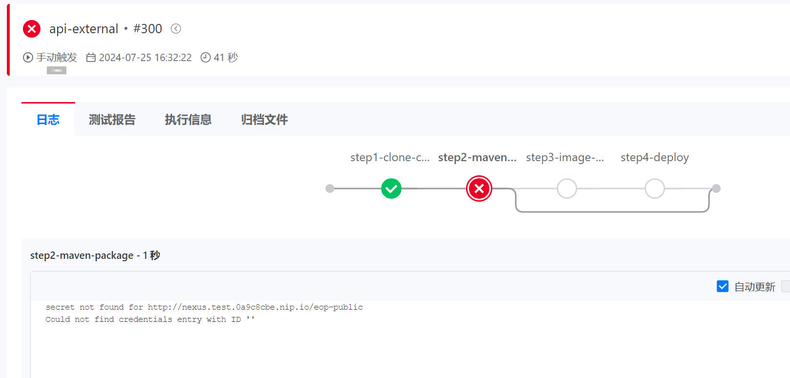
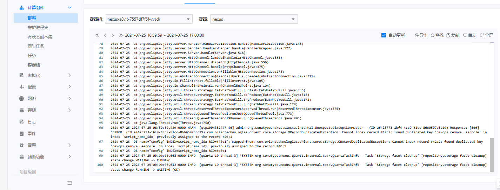
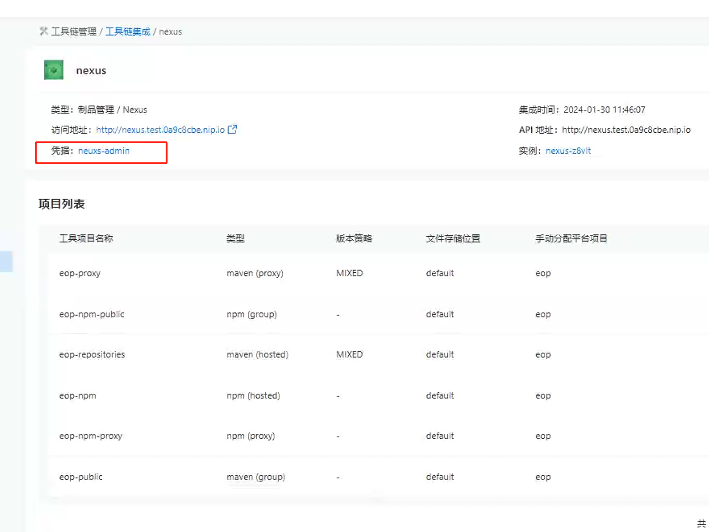
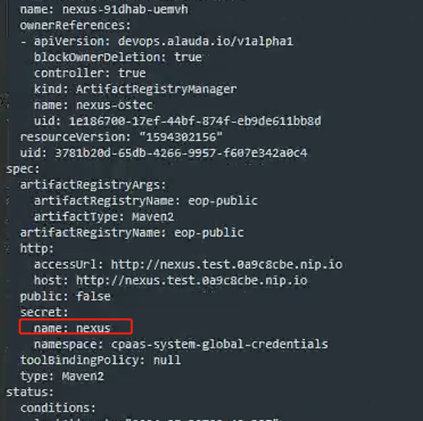
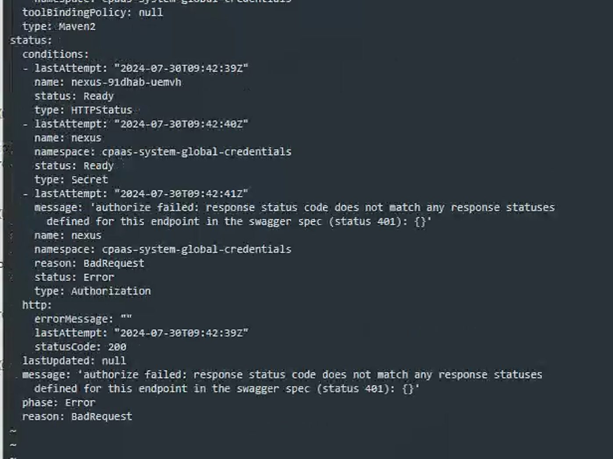
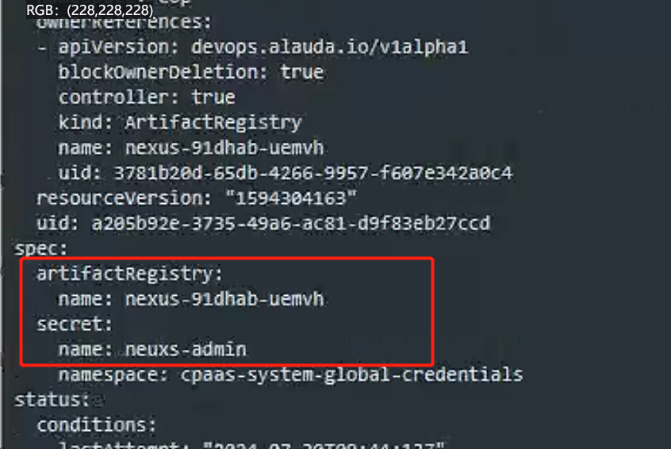
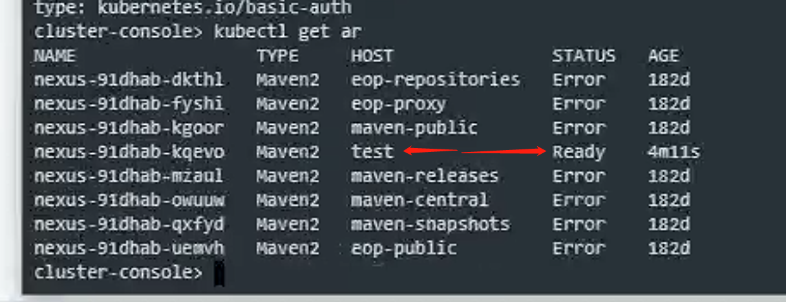
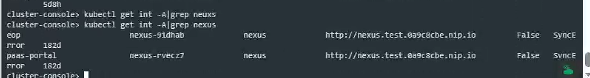
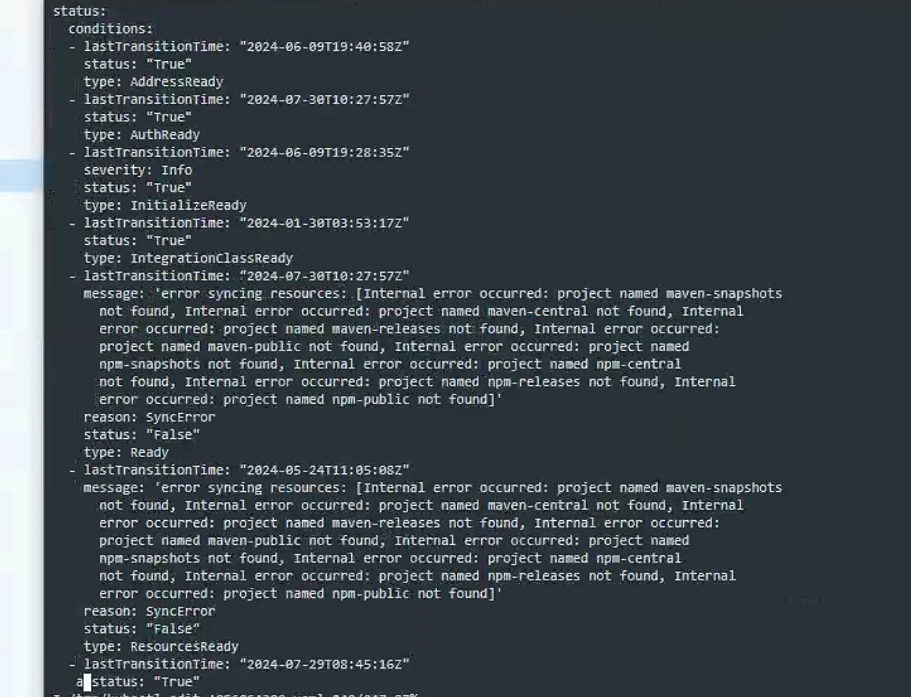
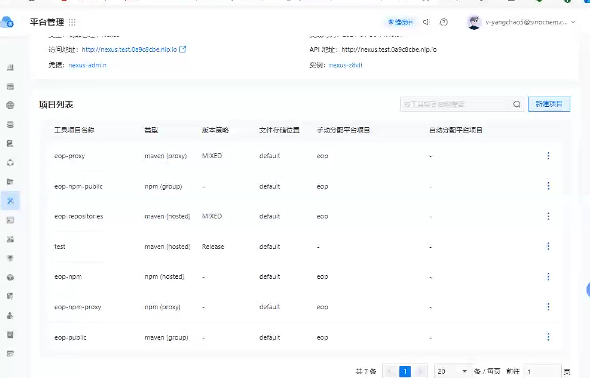

---
kind:
  - Troubleshooting
products:
  - Alauda Container Platform
  - Alauda DevOps
  - Alauda AI
  - Alauda Application Services
  - Alauda Service Mesh
  - Alauda Developer Portal
ProductsVersion:
  - 4.1.0,4.2.x
---
<!-- A type of document that involves encountering a fault, diagnosing it, performing root cause analysis, and providing solutions. -->

# nexus修改过密码 int资源同步失败 流水线执行报错secret not found

流水线执行到maven阶段报错secret not found nexus日志显示401未授权错误 artifactRegistry资源状态异常

## Cause
- 修改nexus密码后integrations同步失败
- artifactRegistry使用的secret与artifactRegistryManager/artifactRegistrybinding不一致(nexus vs nexus-admin)
- clusterintegration中默认仓库缺失导致同步检查失败

## Resolution
- 删除clusterintegration资源中异常的默认仓库(maven-snapshot/maven-release/npm)
- 确保artifactRegistry使用正确的secret(nexus-admin)
- 重建artifactRegistry资源验证状态恢复

## [workaround]

## [Related Information]
**Screenshots**

- Environment: 3.14.1
- clusterintegration
- integration
- artifactRegistry
- artifactRegistryManager
- artifactRegistrybinding
- nexus-admin secret
- maven-snapshot
- maven-release
- npm
- Component: 流水线
- Page ID: 229836047
- Original Title: Devops-流水线-nexus修改过密码 int资源同步失败 流水线执行报错secret not found
