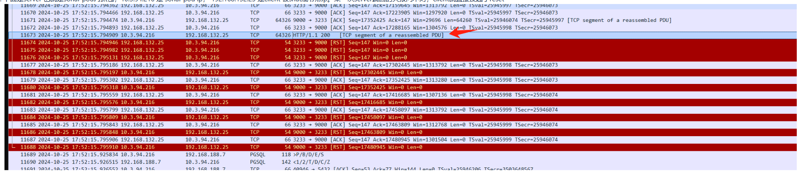

---
kind:
  - Troubleshooting
products:
  - Alauda Container Platform
  - Alauda DevOps
  - Alauda AI
  - Alauda Application Services
  - Alauda Service Mesh
  - Alauda Developer Portal
ProductsVersion:
  - 4.1.0,4.2.x
---
<!-- A type of document that involves encountering a fault, diagnosing it, performing root cause analysis, and providing solutions. -->

# 每日发版流水线小概率偶现Connection reset by peer的报错

访问sonar组件时出现connection reset by peer报错 问题复现频率约每月一次 在pod中运行wget脚本5分钟可稳定复现

## Cause
- nf_conntrack_tcp_be_liberal参数未启用导致：当报文超过TCP窗口大小时，conntrack标记为invalid包，未进行NAT转换

## Resolution
- 设置net.netfilter.nf_conntrack_tcp_be_liberal = 1

## [workaround]

## [Related Information]
**Screenshots**

- Environment: Kubernetes 版本：3.18.0
- sonar-scanner-engine-shaded-9.9.6.92038-all.jar
- NodePort
- nf_conntrack_tcp_be_liberal
- TCP窗口大小
- Component: 流水线
- Page ID: 242090652
- Original Title: 每日发版流水线小概率偶现Connection reset by peer的报错
