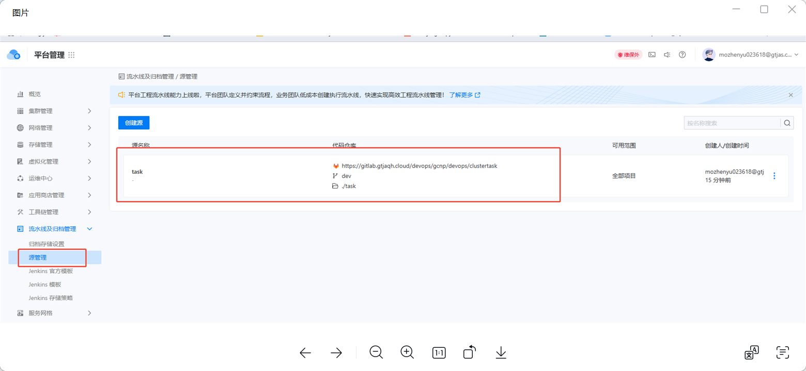
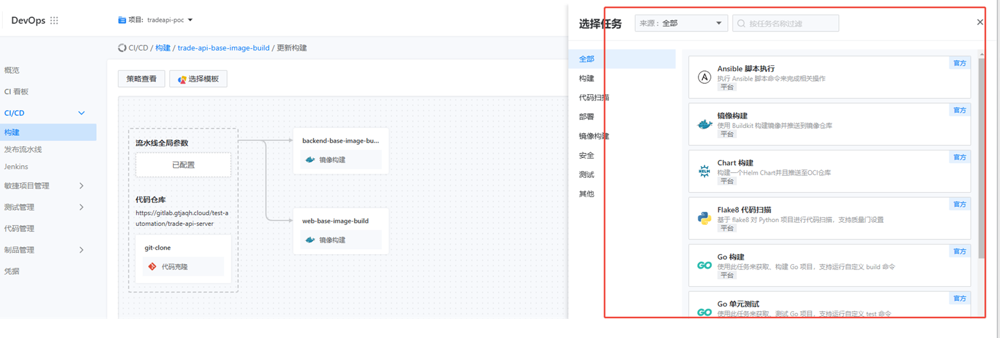
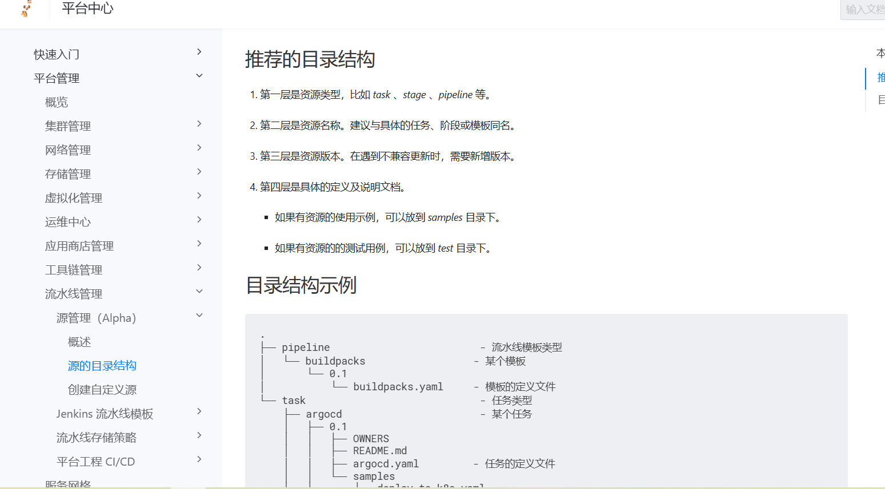
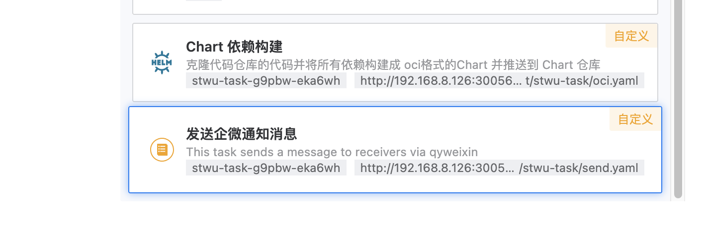
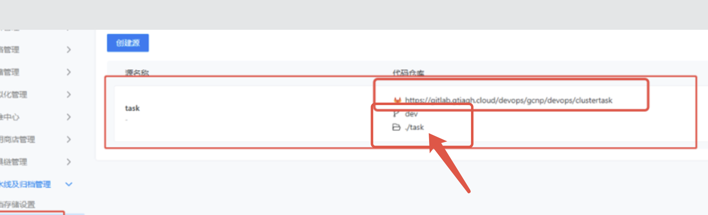
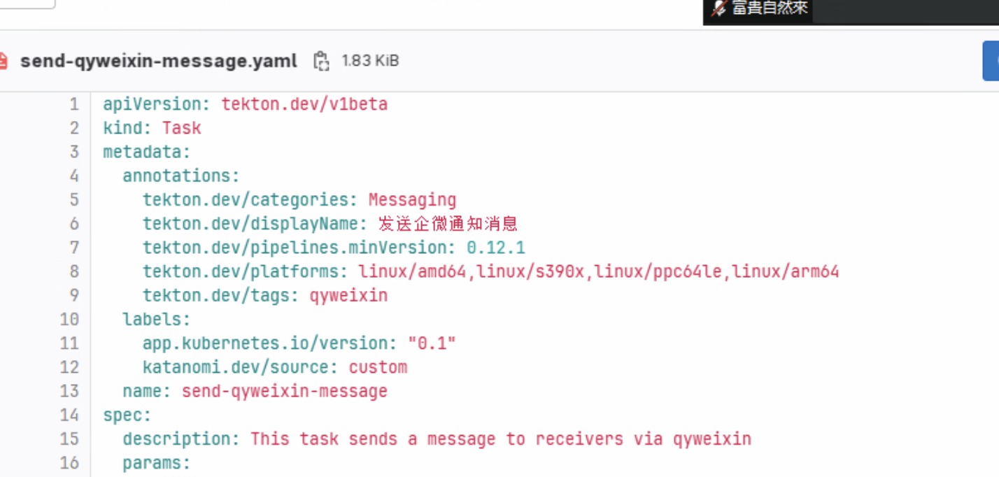

---
kind:
  - Troubleshooting
products:
  - Alauda Container Platform
  - Alauda DevOps
  - Alauda AI
  - Alauda Application Services
  - Alauda Service Mesh
  - Alauda Developer Portal
ProductsVersion:
  - 4.1.0,4.2.x
---
<!-- A type of document that involves encountering a fault, diagnosing it, performing root cause analysis, and providing solutions. -->

# 实验环境里配置了流水线的源，但是在流水线任务中没有生效

流水线源配置未生效 特定task（发送微信）未显示或执行失败

## Cause
- task的apiVersion配置错误（非v1beta1）

## Resolution
- 修正yaml中task的apiVersion为v1beta1

## [workaround]

## [Related Information]
**Screenshots**

- Environment: 3.14.2
- task文件
- yaml配置
- apiVersion
- Component: 流水线
- Page ID: 268536198
- Original Title: Devops-实验环境里配置了流水线的源，但是在流水线任务中没有生效-100345
