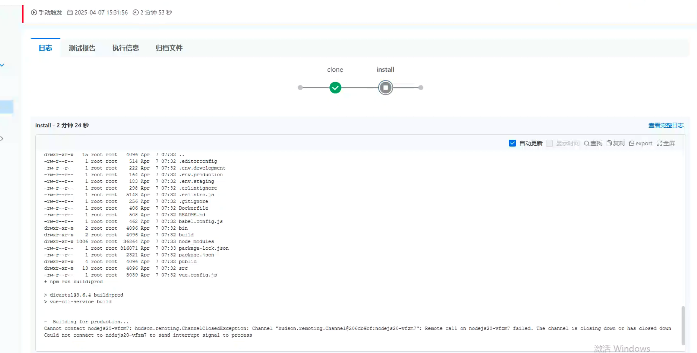
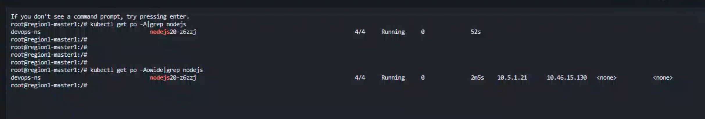
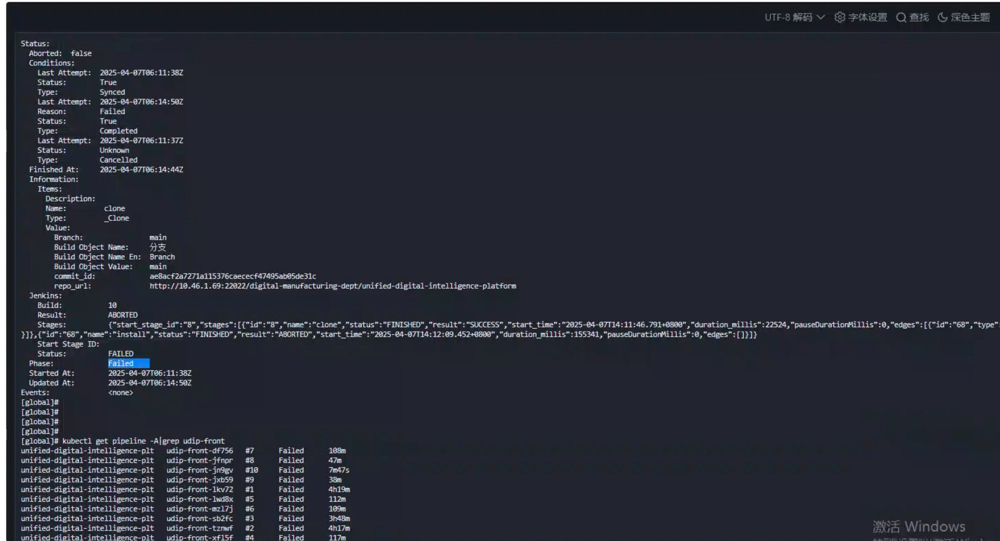
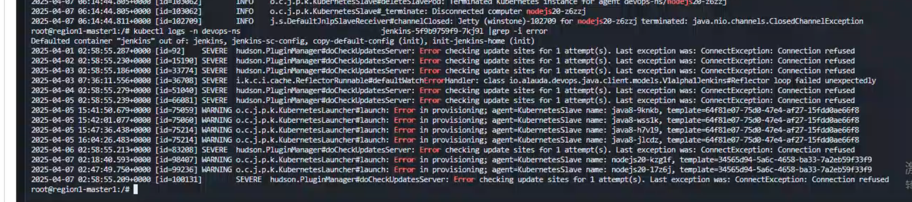
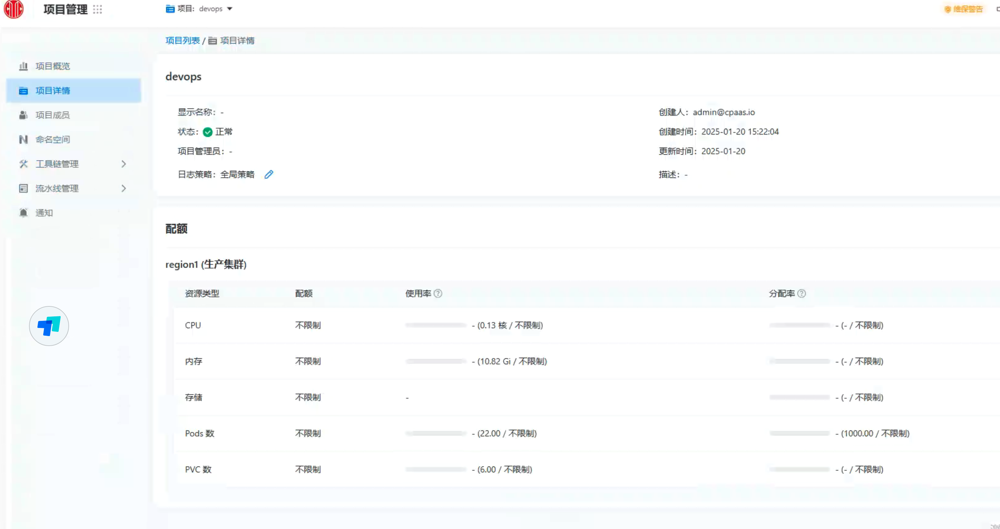

---
kind:
  - Troubleshooting
products:
  - Alauda Container Platform
  - Alauda DevOps
  - Alauda AI
  - Alauda Application Services
  - Alauda Service Mesh
  - Alauda Developer Portal
ProductsVersion:
  - 4.1.0,4.2.x
---
<!-- A type of document that involves encountering a fault, diagnosing it, performing root cause analysis, and providing solutions. -->

# 流水线执行失败

流水线执行失败报错 Jenkins pod报错 调整nodejs20容器资源限制后无效

## Cause
- nodejs20容器资源限制不足

## Resolution
- 调大nodejs20容器的资源限制

## [workaround]

## [Related Information]
**Screenshots**

- Environment: 3.18
- nodejs20容器
- Jenkins pod
- 资源限制配置
- Component: 流水线
- Page ID: 274694724
- Original Title: Devops-流水线执行失败-104947
