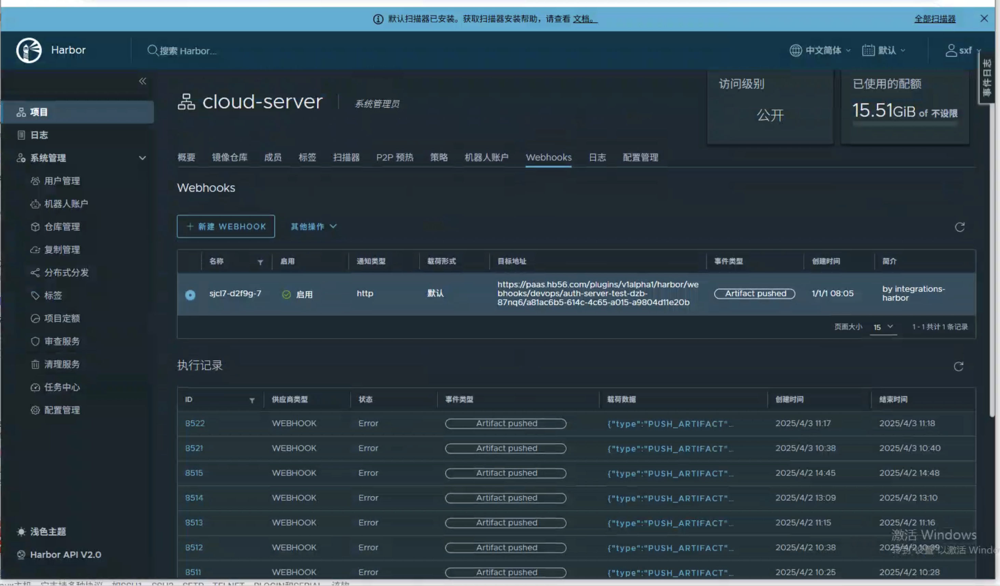
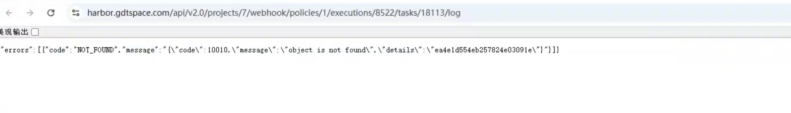

---
kind:
  - Troubleshooting
products:
  - Alauda Container Platform
  - Alauda DevOps
  - Alauda AI
  - Alauda Application Services
  - Alauda Service Mesh
  - Alauda Developer Portal
ProductsVersion:
  - 4.1.0,4.2.x
---
<!-- A type of document that involves encountering a fault, diagnosing it, performing root cause analysis, and providing solutions. -->

# 发布流水线

问题原因：镜像仓库的webhook配置未正确设置或未生效，导致无法向流水线发送tag变化的通知。

## Cause

## Resolution
- 发布流水线配置了制品触发器，规则设置为当探测到镜像仓库中有新的镜像tag时自动触发流水线更新。但在实际操作中，当新的镜像tag被推送到镜像仓库后，流水线并未按预期触发。
- ## 排查过程
- 1. 检查流水线配置中的制品触发器设置，确认触发器规则已正确配置为监听镜像tag变化。
- 3. 检查流水线日志，确认没有收到来自镜像仓库的webhook通知。
- ## 解决方法
- 1. 检查并确保镜像仓库的webhook已正确配置，指向流水线的触发器端点。
- 2. 验证webhook的权限设置，确保有足够的权限发送通知。
- 4. 如果使用自签名证书，确保流水线服务能够验证该证书。

## [workaround]

## [Related Information]
**Screenshots**

- 18
- 2581
- 2588
- /devops-fa-bu-liu-shui-xian-zhi-pin-hong-fa-qi-wen-ti-104656-zh/mceclip0_1744611606681_2vcug.png
- /devops-fa-bu-liu-shui-xian-zhi-pin-hong-fa-qi-wen-ti-104656-zh/mceclip1_1744611610430_1ja5g.png
- /devops-fa-bu-liu-shui-xian-zhi-pin-hong-fa-qi-wen-ti-104656-zh/1743560558_99781_d2c160_
- Component: 流水线
- Page ID: 277807593
- Original Title: Devops-发布流水线-制品触发器问题-104656-zh
