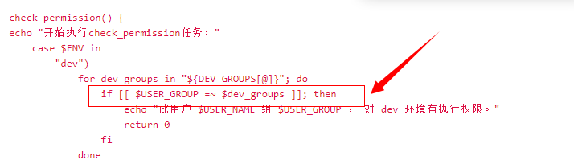
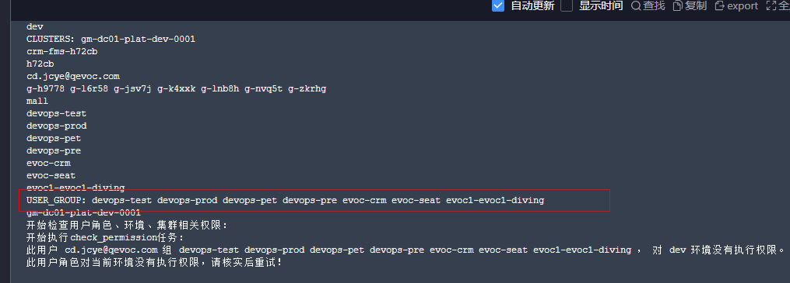
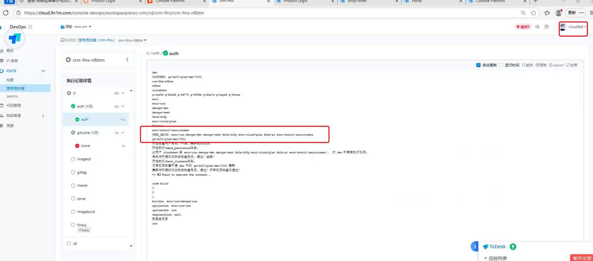
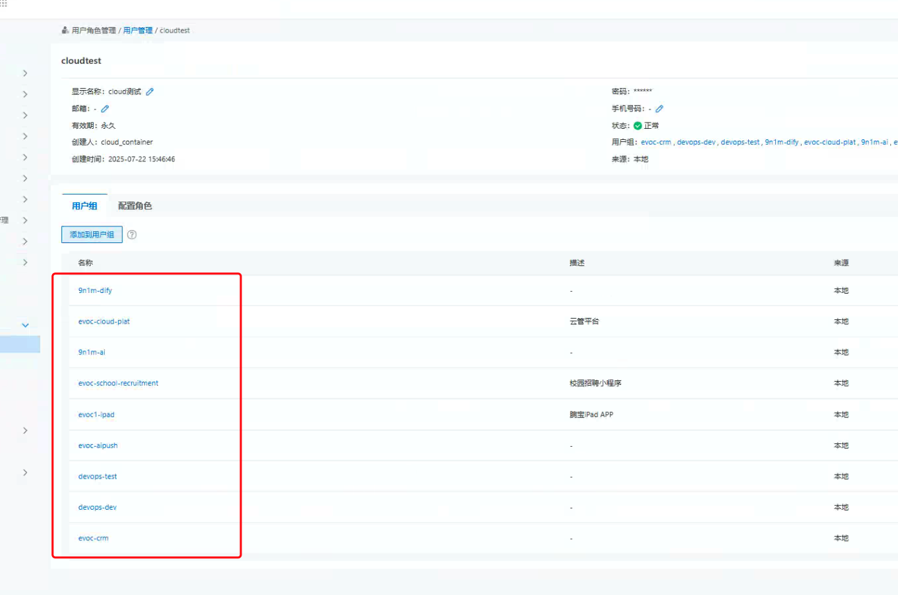
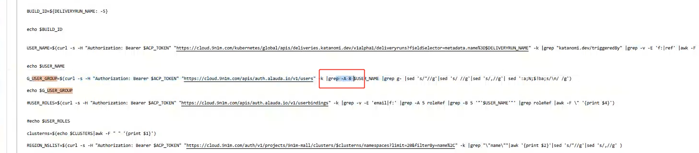

---
kind:
  - Troubleshooting
products:
  - Alauda Container Platform
  - Alauda DevOps
  - Alauda AI
  - Alauda Application Services
  - Alauda Service Mesh
  - Alauda Developer Portal
ProductsVersion:
  - 4.1.0,4.2.x
---
<!-- A type of document that involves encountering a fault, diagnosing it, performing root cause analysis, and providing solutions. -->

# 容器云流水线USERGROUP 最多只能获取7个，环境执行权限判

用户已加入多个用户组但流水线日志显示仅7个用户组 环境执行权限判断未通过

## Cause
- USER_GROUP取值逻辑仅获取关键词后8条数据
- 实际用户组数据分布在关键词后200多行位置

## Resolution
- 调整用户组数据获取范围为50-100行

## [workaround]

## [Related Information]
**Screenshots**

- Environment: 3.18.1
- tekton-template
- USER_GROUP
- auth日志
- Component: 流水线
- Page ID: 324174532
- Original Title: Devops-容器云流水线USERGROUP 最多只能获取7个，环境执行权限判-NC0162-113584
