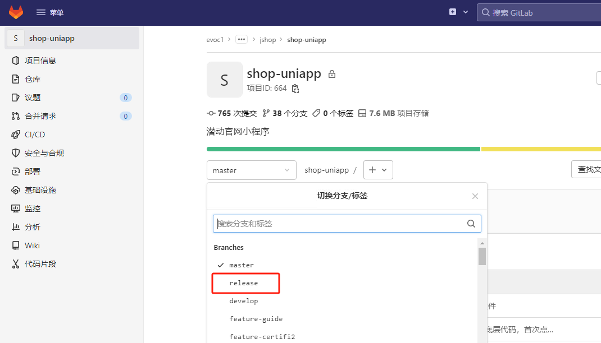
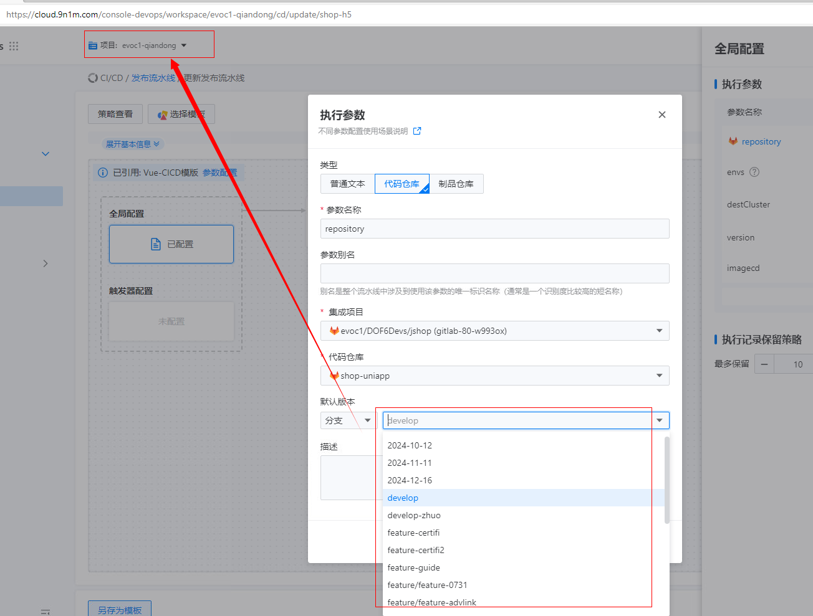

---
kind:
  - Troubleshooting
products:
  - Alauda Container Platform
  - Alauda DevOps
  - Alauda AI
  - Alauda Application Services
  - Alauda Service Mesh
  - Alauda Developer Portal
ProductsVersion:
  - 4.1.0,4.2.x
---
<!-- A type of document that involves encountering a fault, diagnosing it, performing root cause analysis, and providing solutions. -->

# 容器云流水线无法获取代码分支

容器云流水线无法获取代码分支 release分支在容器云流水线里看不到

## Cause
- 前端展示限制最多显示20个分支
- 需要输入接近完整的分支名称才能触发提示

## Resolution
- 通过输入框输入完整分支名称进行补全操作

## [workaround]
- 输入接近完整的分支名称触发自动补全功能

## [Related Information]
**Screenshots**

- Environment: 3.18.1
- 分支选择组件
- 自动补全功能
- Component: 流水线
- Page ID: 324174543
- Original Title: Devops-容器云流水线无法获取代码分支-113518
