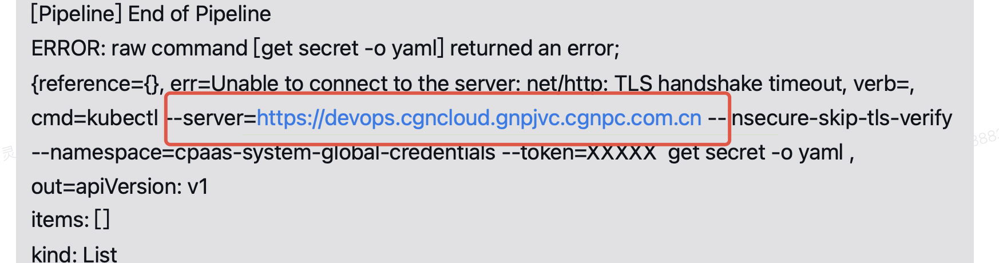

---
kind:
  - Troubleshooting
products:
  - Alauda Container Platform
  - Alauda DevOps
  - Alauda AI
  - Alauda Application Services
  - Alauda Service Mesh
  - Alauda Developer Portal
ProductsVersion:
  - 4.1.0,4.2.x
---
<!-- A type of document that involves encountering a fault, diagnosing it, performing root cause analysis, and providing solutions. -->

# 流水想运行报错

流水线执行失败 kubectl 命令请求超时

## Cause
- 节点挂掉导致 apiserver 状态异常
- 请求负载到异常节点的 apiserver

## Resolution
- 启动挂掉的节点
- 确保节点状态变为 Ready

## [workaround]

## [Related Information]
**Screenshots**

- Environment: 3.14.1
- apiserver
- kubectl
- 平台地址
- 节点状态
- Component: 流水线
- Page ID: 330465827
- Original Title: Devops-流水线-流水想运行报错-114682
