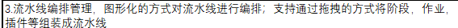

---
kind:
  - Troubleshooting
products:
  - Alauda Container Platform
  - Alauda DevOps
  - Alauda AI
  - Alauda Application Services
  - Alauda Service Mesh
  - Alauda Developer Portal
ProductsVersion:
  - 4.1.0,4.2.x
---
<!-- A type of document that involves encountering a fault, diagnosing it, performing root cause analysis, and providing solutions. -->

# 流水线支持拖拽？

流水线不支持拖拽

## Cause
- Jenkins流水线和Tekton流水线均不支持拖拽功能

## Resolution

## [workaround]

## [Related Information]
**Screenshots**

- Environment: 3.18.1
- jenkins
- tekton
- Component: 流水线
- Page ID: 330465879
- Original Title: Devops-流水线-流水线支持拖拽？-112222
