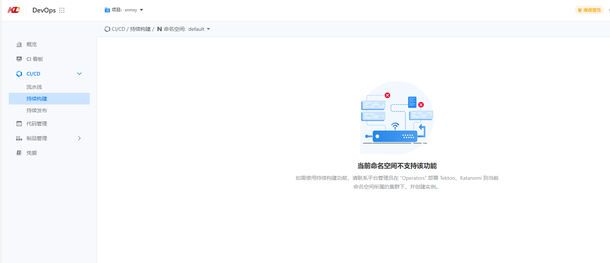

---
kind:
  - Troubleshooting
products:
  - Alauda Container Platform
  - Alauda DevOps
  - Alauda AI
  - Alauda Application Services
  - Alauda Service Mesh
  - Alauda Developer Portal
ProductsVersion:
  - 4.1.0,4.2.x
---
<!-- A type of document that involves encountering a fault, diagnosing it, performing root cause analysis, and providing solutions. -->

# 流水线创建双架构镜像

部分命名空间无法使用双架构流水线功能

## Cause
- 对应集群未安装 tekton 和 katanomi 实例

## Resolution
- 在对应集群安装 tekton 和 katanomi 实例

## [workaround]

## [Related Information]
**Screenshots**

- Environment: 3.12.4
- tekton-operator
- katanomi-operator
- Component: 流水线
- Page ID: 330466236
- Original Title: Devops-流水线创建双架构镜像-115150
