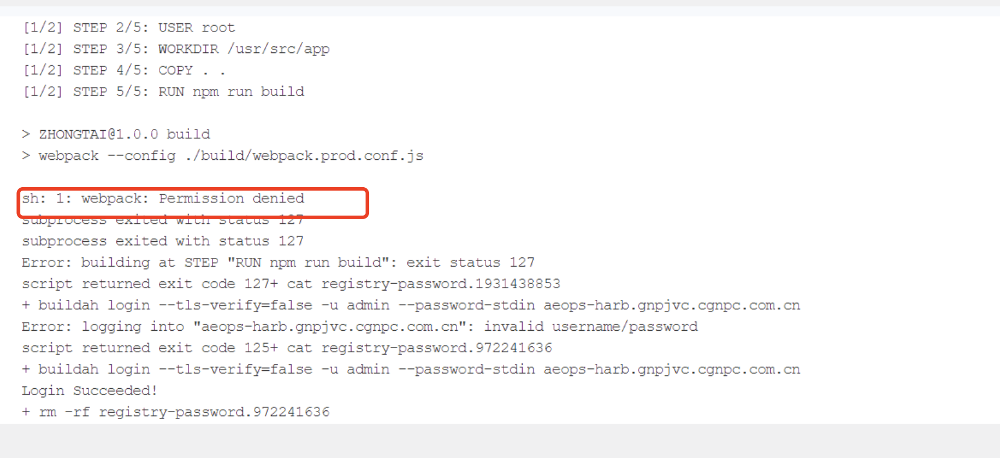
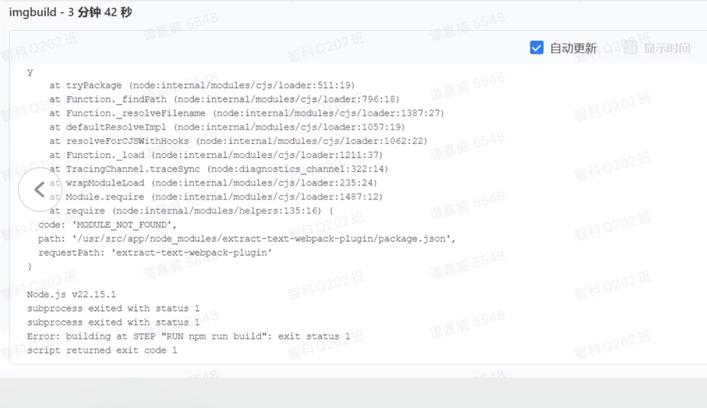

---
kind:
  - Troubleshooting
products:
  - Alauda Container Platform
  - Alauda DevOps
  - Alauda AI
  - Alauda Application Services
  - Alauda Service Mesh
  - Alauda Developer Portal
ProductsVersion:
  - 4.1.0,4.2.x
---
<!-- A type of document that involves encountering a fault, diagnosing it, performing root cause analysis, and providing solutions. -->

# 流水线编译失败

流水线编译日志报错webpack文件权限不足 依赖加载异常

## Cause
- node_modules/.bin目录权限不足
- nodejs版本不兼容（客户使用v12 vs 平台默认v22）

## Resolution
- 在Dockerfile添加RUN chmod +x node_modules/.bin/*
- 使用nodejs 12版本节点执行流水线

## [workaround]

## [Related Information]
**Screenshots**

- Environment: 4.0.3
- node_modules/.bin
- Dockerfile
- nodejs版本配置
- tomcat容器
- Component: 流水线
- Page ID: 333316778
- Original Title: Devops-流水线-流水线编译失败-115438
