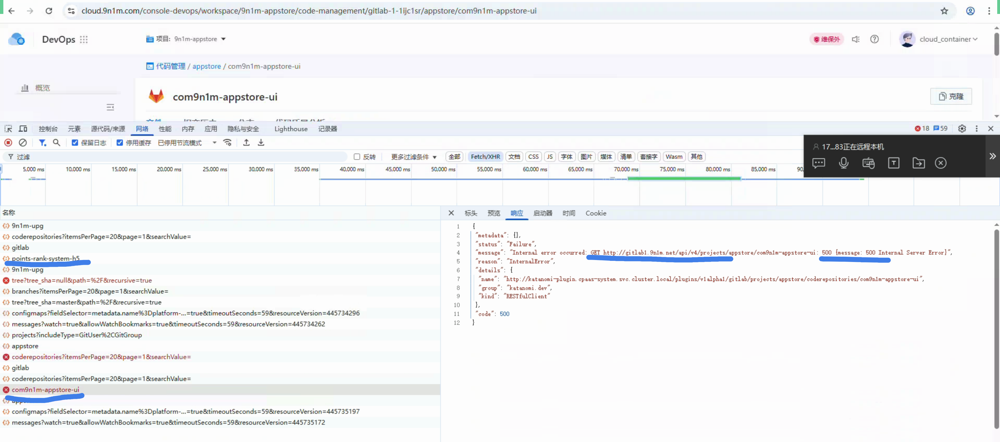

---
kind:
  - Troubleshooting
products:
  - Alauda Container Platform
  - Alauda DevOps
  - Alauda AI
  - Alauda Application Services
  - Alauda Service Mesh
  - Alauda Developer Portal
ProductsVersion:
  - 4.1.0,4.2.x
---
<!-- A type of document that involves encountering a fault, diagnosing it, performing root cause analysis, and providing solutions. -->

# 流水线选不到分支

流水线选不到分支 请求appstore组代码仓库返回500错误

## Cause
- git-common用户对appstore组权限不足或配置错误

## Resolution
- 检查git-common用户在appstore组的权限分配
- 对比upg组和appstore组的权限配置差异
- 确保gitlab API接口正常返回仓库信息
- 验证容器云流水线配置的凭证有效性

## [workaround]
- 临时使用upg组仓库验证基础功能

## [Related Information]
**Screenshots**

- Environment: 3.18.1
- gitlab API接口
- git-common用户
- appstore组
- 容器云凭证配置
- Component: 流水线
- Page ID: 336396995
- Original Title: Devops-流水线选不到分支-115843
