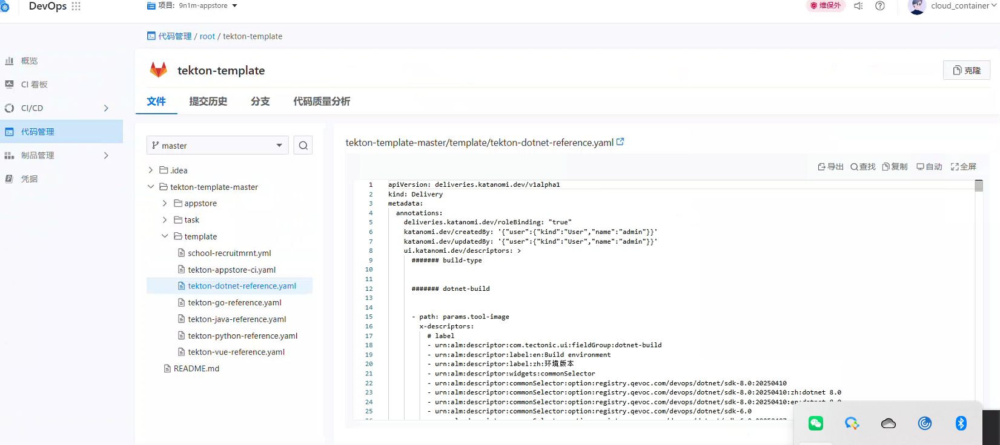
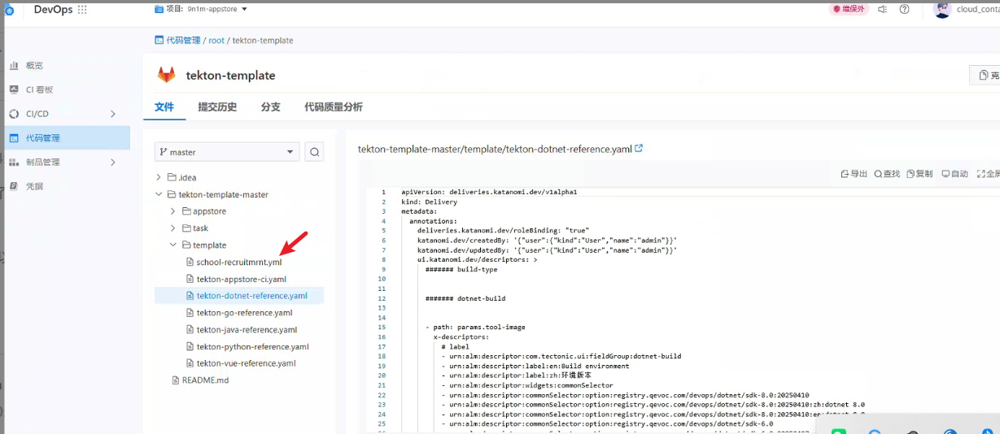
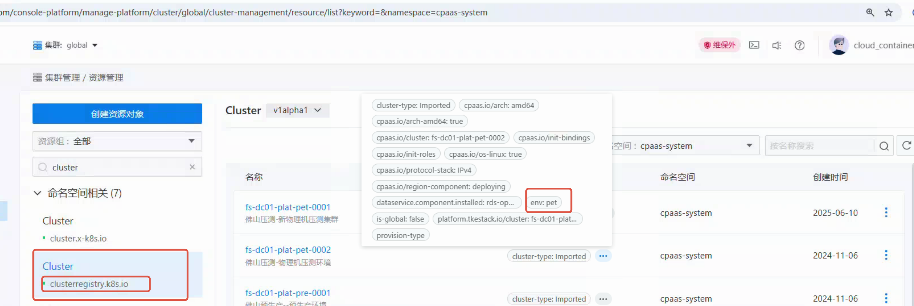
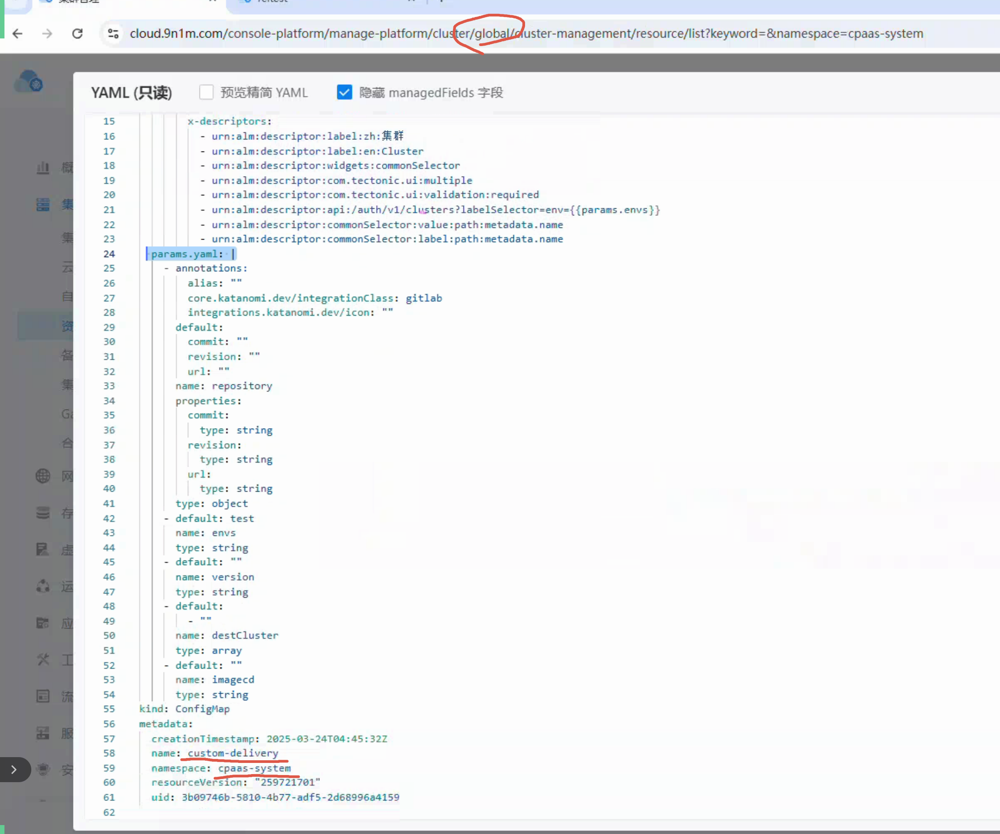

---
kind:
  - Troubleshooting
products:
  - Alauda Container Platform
  - Alauda DevOps
  - Alauda AI
  - Alauda Application Services
  - Alauda Service Mesh
  - Alauda Developer Portal
ProductsVersion:
  - 4.1.0,4.2.x
---
<!-- A type of document that involves encountering a fault, diagnosing it, performing root cause analysis, and providing solutions. -->

# 流水线执行参数配置问题

无法修改执行参数默认值 无法新增或修改执行参数字段 构建时无法选择新添加的集群

## Cause
- 3.18版本构建参数不支持下拉列表选择集群
- 全局参数通过global集群的custom-delievy ConfigMap固定写死5个参数
- 环境与集群关系依赖global集群的cluster.registry.k8s.io资源label配置

## Resolution
- 升级到4.0版本支持下拉列表选择集群
- 在global集群的custom-delievy ConfigMap中添加新参数
- 通过cluster.registry.k8s.io资源的label配置环境与集群关系

## [workaround]

## [Related Information]
**Screenshots**

这边查了一下，全局配置参数在tekton-template下的模板配置文件内，界面暴露出来的在 yaml params的最前面，单独把这几个提出来暴露的,修改的话可以再里面添加

2.tekton-template目录下面，具体指的是这个，里面有参数配置，界面暴露出来的在 yaml 的最前面，单独把这几个提出来暴露的。

- Environment: 3.18.1
- tekton-template
- auth.yaml
- cluster.registry.k8s.io
- custom-delievy ConfigMap
- Component: 流水线
- Page ID: 336397051
- Original Title: Devops-流水线执行参数配置问题-114919
