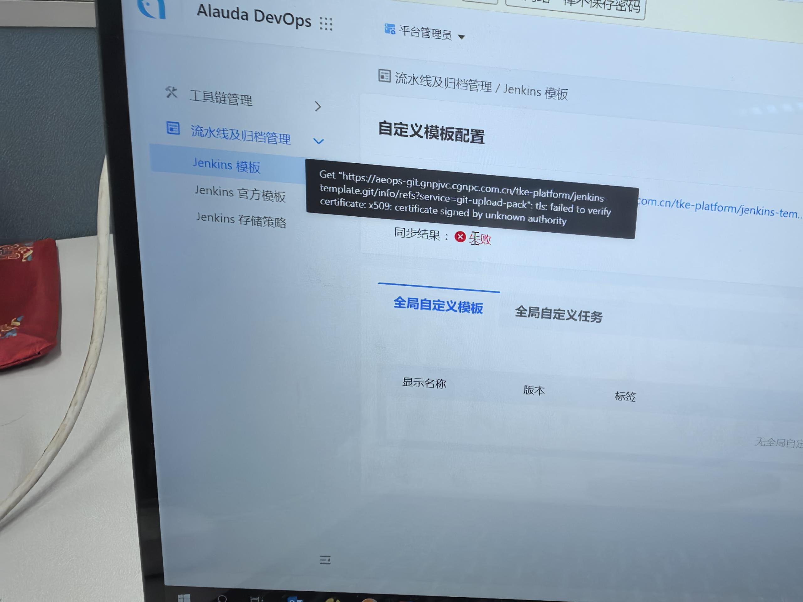
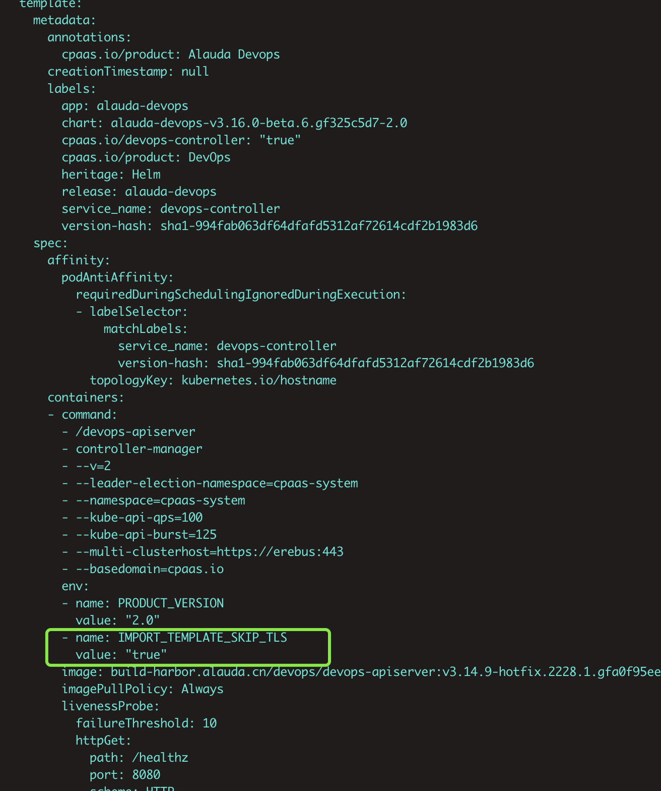

---
kind:
  - Troubleshooting
products:
  - Alauda Container Platform
  - Alauda DevOps
  - Alauda AI
  - Alauda Application Services
  - Alauda Service Mesh
  - Alauda Developer Portal
ProductsVersion:
  - 4.1.0,4.2.x
---
<!-- A type of document that involves encountering a fault, diagnosing it, performing root cause analysis, and providing solutions. -->

# jenkins流水线模板同步失败报错TLS证书错误

流水线模板同步失败 TLS证书错误

## Cause
- gitlab使用https协议时devops-controller未配置TLS证书验证跳过

## Resolution
- 修改devops-controller deployment yaml添加环境变量GIT_SSL_NO_VERIFY: "true"

## [workaround]

## [Related Information]
**Screenshots**

- Environment: 3.14以上
- devops-controller
- deployment.yaml
- GIT_SSL_NO_VERIFY
- Component: 流水线
- Page ID: 342670822
- Original Title: Devops-jenkins流水线模板同步失败报错TLS证书错误
