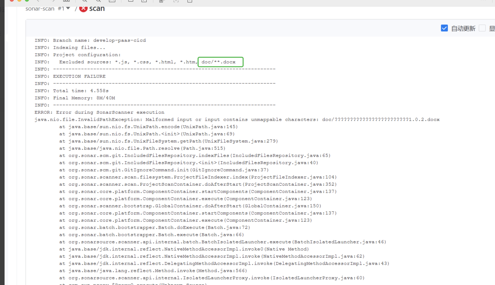

---
kind:
  - Troubleshooting
products:
  - Alauda Container Platform
  - Alauda DevOps
  - Alauda AI
  - Alauda Application Services
  - Alauda Service Mesh
  - Alauda Developer Portal
ProductsVersion:
  - 4.1.0,4.2.x
---
<!-- A type of document that involves encountering a fault, diagnosing it, performing root cause analysis, and providing solutions. -->

# sonarqube扫描无法识别中文文件名问题

排除规则未生效，指定排除的中文文件仍被扫描

## Cause
- SonarQube镜像缺少UTF-8语言环境支持，加载中文文件时出现编码问题导致排除配置未生效

## Resolution
- 修改Dockerfile安装语言包：apt-get install language-pack-zh-hans locales
- 配置locale环境：locale-gen en_US.UTF-8 && update-locale LC_ALL=en_US.UTF-8
- 设置环境变量：ENV LANG=en_US.UTF-8
- 更新sonar-task使用的tool-image镜像

## [workaround]

## [Related Information]
**Screenshots**

- Environment: 3.16.2
- sonar.exclusions
- Dockerfile
- locale-gen
- update-locale
- language-pack-zh-hans
- Component: 流水线
- Page ID: 345538849
- Original Title: Devops-sonarqube扫描无法识别中文文件名问题
