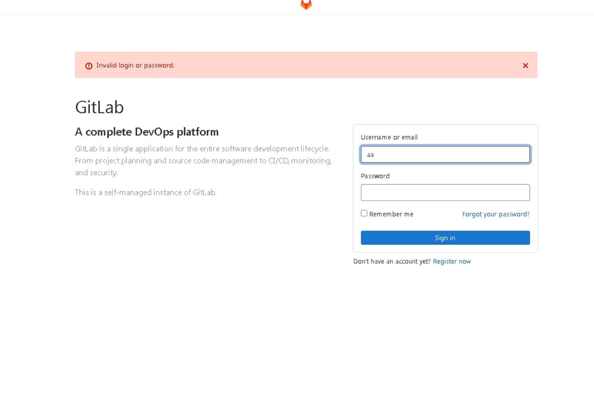
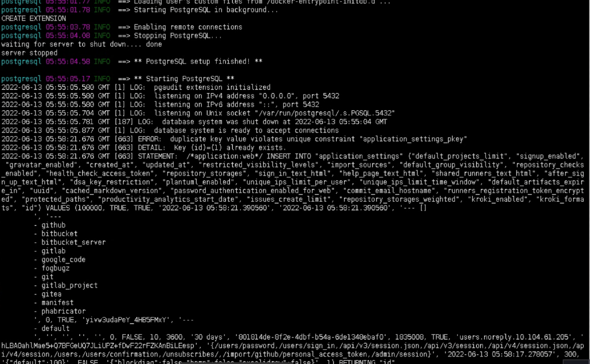
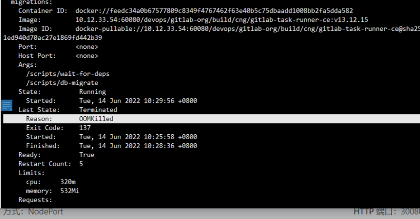
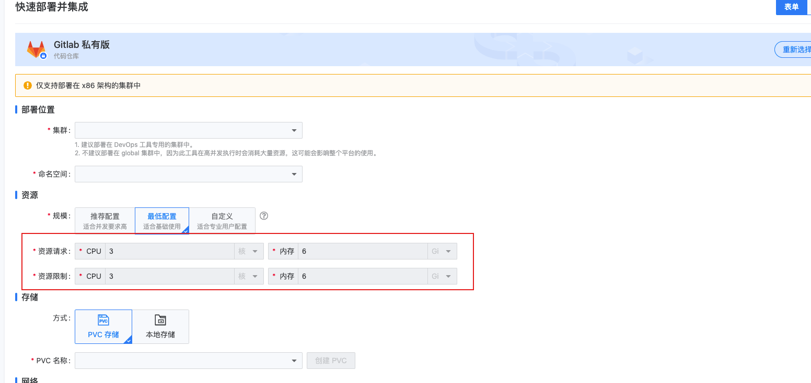

---
kind:
  - Troubleshooting
products:
  - Alauda Container Platform
  - Alauda DevOps
  - Alauda AI
  - Alauda Application Services
  - Alauda Service Mesh
  - Alauda Developer Portal
ProductsVersion:
  - 4.1.0,4.2.x
---
<!-- A type of document that involves encountering a fault, diagnosing it, performing root cause analysis, and providing solutions. -->

# gitlab部署并集成之后无法登陆

部署完成后无法登录，报错用户名或密码错误 gitlab-postgresql容器日志显示插入数据报错 postgres数据库用户信息无记录

## Cause
- 资源不足导致数据初始化失败

## Resolution
- 增加gitlab资源至最小配置要求

## [workaround]

## [Related Information]
**Screenshots**

- Environment: 3.8.1
- gitlab-postgresql容器
- postgres数据库
- migration job
- 资源限制配置
- Component: gitlab
- Page ID: 115535029
- Original Title: gitlab部署并集成之后无法登陆
