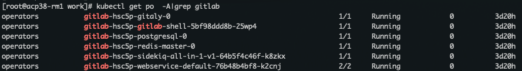

---
kind:
  - Troubleshooting
products:
  - Alauda Container Platform
  - Alauda DevOps
  - Alauda AI
  - Alauda Application Services
  - Alauda Service Mesh
  - Alauda Developer Portal
ProductsVersion:
  - 4.1.0,4.2.x
---
<!-- A type of document that involves encountering a fault, diagnosing it, performing root cause analysis, and providing solutions. -->

# Gitlab组件架构

无法读写Git数据 SSH访问存储库失败 元数据存储或读取失败

## Cause

## Resolution

## [workaround]

## [Related Information]
**Screenshots**

- Environment: 通用
- Gitaly
- Gitlab-shell
- Postgresql
- Redis
- Sidekiq
- Webservice
- repositories:section
- Component: gitlab
- Page ID: 115537699
- Original Title: Gitlab组件架构
