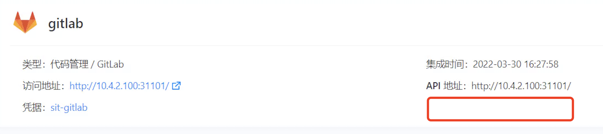
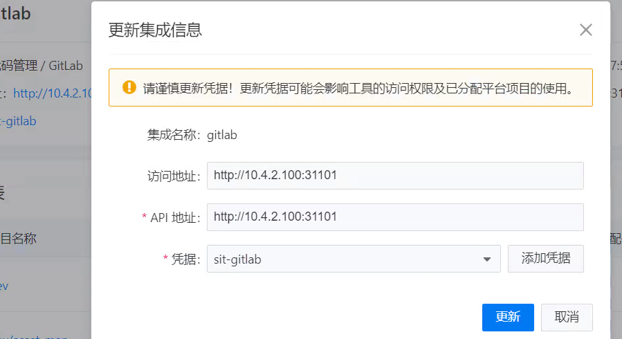
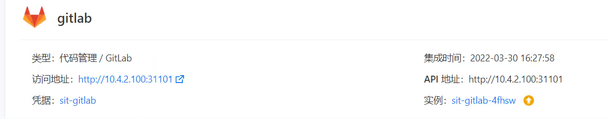

---
kind:
  - Troubleshooting
products:
  - Alauda Container Platform
  - Alauda DevOps
  - Alauda AI
  - Alauda Application Services
  - Alauda Service Mesh
  - Alauda Developer Portal
ProductsVersion:
  - 4.1.0,4.2.x
---
<!-- A type of document that involves encountering a fault, diagnosing it, performing root cause analysis, and providing solutions. -->

# 3.7升3.8.1后工具链集成gitlab实例不显示

工具链集成中的GitLab实例信息不显示

## Cause
- 集成API地址末尾包含多余斜杠/导致地址匹配失败

## Resolution
- 1. 进入集成配置界面
2. 编辑GitLab集成
3. 移除API地址和访问地址末尾的/
4. 更新保存配置

## [workaround]

## [Related Information]
**Screenshots**

- Environment: 3.7版本升级到3.8版本
- gitlab集成配置
- clusterintegration关联逻辑
- api_url配置项
- 访问地址配置项
- 工具链控制器组件
- Component: gitlab
- Page ID: 120103805
- Original Title: 3.7升3.8.1后工具链集成gitlab实例不显示
