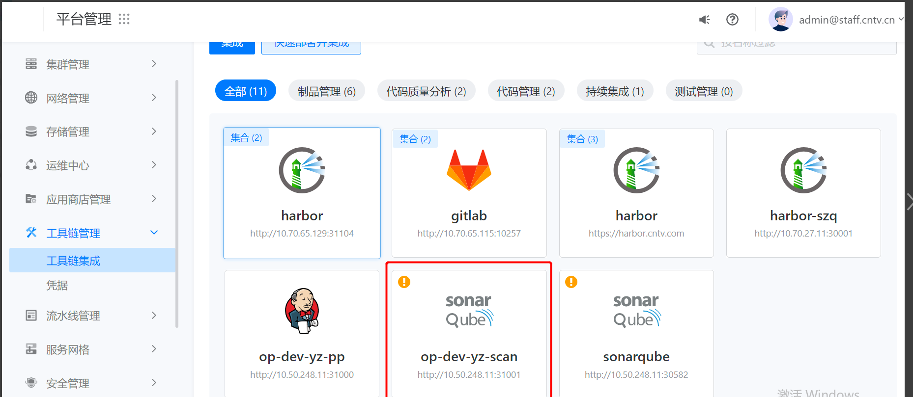

---
kind:
  - Troubleshooting
products:
  - Alauda Container Platform
  - Alauda DevOps
  - Alauda AI
  - Alauda Application Services
  - Alauda Service Mesh
  - Alauda Developer Portal
ProductsVersion:
  - 4.1.0,4.2.x
---
<!-- A type of document that involves encountering a fault, diagnosing it, performing root cause analysis, and providing solutions. -->

# 3.8.1

点击删除按钮直接跳回主页面，删除无反应 kubectl delete cint 无法删除资源 devops-controller 重启

## Cause
- gitlab 实例被删除导致 coderepository CR 不存在
- devops-controller 因 watch coderepository 资源失败无法处理 finalizer

## Resolution
- 手动删除 clusterintegration/codereposervice/coderepobind 资源
- kubectl edit cint xxxx 删除 finalizer 字段

## [workaround]

## [Related Information]
**Screenshots**

2、发现devops-controller会重启，查看devops-controller日志，发现 watch coderepository CR 已经不存在
- Environment: TKE 3.8
- clusterintegration
- coderepository
- codereposervice
- coderepobind
- devops-controller
- devops-apiserver
- finalizer
- Component: gitlab
- Page ID: 124682963
- Original Title: 3.8.1-集成无法删除
