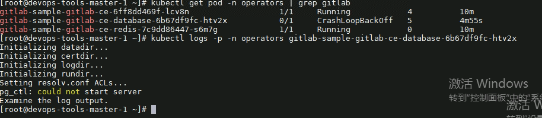

---
kind:
  - Troubleshooting
products:
  - Alauda Container Platform
  - Alauda DevOps
  - Alauda AI
  - Alauda Application Services
  - Alauda Service Mesh
  - Alauda Developer Portal
ProductsVersion:
  - 4.1.0,4.2.x
---
<!-- A type of document that involves encountering a fault, diagnosing it, performing root cause analysis, and providing solutions. -->

# gitlab database报错

gitlab database pod异常，无法启动 日志报错：pg_ctl: could not start server gitlab portal连接database失败，容器弹出无法启动

## Cause
- 数据库损坏（需通过pg_resetxlog恢复）
- 老版本gitlabs在TKE3.6升级到3.8时可能存在兼容性问题

## Resolution
- 部署全新gitlabs 11.4版本
- 将旧gitlab备份拷贝至新环境并恢复
- 修改新gitlab的nodePort为原损坏环境端口

## [workaround]
- 使用pg_resetxlog -f /var/lib/postgresql恢复数据库
- 手动dump/恢复pgsql数据（无备份时）

## [Related Information]
**Screenshots**

- Environment: 非官方gitlabs（400多天前版本），TKE3.6升级至3.8环境
- gitlab-database
- pg_ctl
- pg_resetxlog
- /var/lib/postgresql
- devops-tools-operator
- Component: gitlab
- Page ID: 130562785
- Original Title: gitlab database报错
