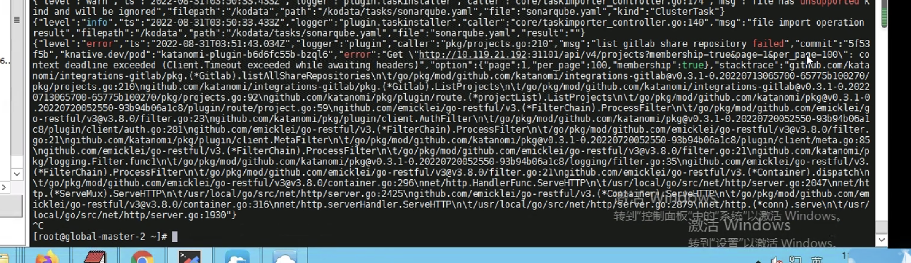

---
kind:
  - Troubleshooting
products:
  - Alauda Container Platform
  - Alauda DevOps
  - Alauda AI
  - Alauda Application Services
  - Alauda Service Mesh
  - Alauda Developer Portal
ProductsVersion:
  - 4.1.0,4.2.x
---
<!-- A type of document that involves encountering a fault, diagnosing it, performing root cause analysis, and providing solutions. -->

# 更换gitlab后执行流水线报secret not found

执行流水线报secret not found

## Cause
- gitlab集成的访问地址与API地址指向192节点地址，原116的vip地址在katanomi plugin组件存在网络不通问题

## Resolution
- 将gitlab集成地址改为192节点地址，重新选择仓库/分支并更新流水线配置

## [workaround]

## [Related Information]
**Screenshots**

- Environment: TEK 3.6.1
- katanomi plugin
- gitlab集成配置
- 116地址
- 192节点地址
- Component: gitlab
- Page ID: 130562809
- Original Title: 更换gitlab后执行流水线报secret not found
