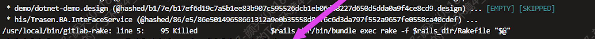
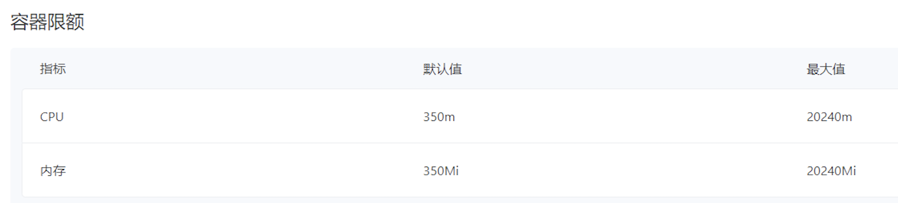

---
kind:
  - Troubleshooting
products:
  - Alauda Container Platform
  - Alauda DevOps
  - Alauda AI
  - Alauda Application Services
  - Alauda Service Mesh
  - Alauda Developer Portal
ProductsVersion:
  - 4.1.0,4.2.x
---
<!-- A type of document that involves encountering a fault, diagnosing it, performing root cause analysis, and providing solutions. -->

# GitlabOfficial备份失败

GitlabOfficial备份失败 报错/usr/local/bin/girlab-rake line 5 95 killed

## Cause
- gitlab的ns空间容器限额太小

## Resolution
- 调整ns限额到500m以上

## [workaround]

## [Related Information]
**Screenshots**

- Environment: 3.8.2
- ns空间容器限额
- Component: gitlab
- Page ID: 140807372
- Original Title: GitlabOfficial备份失败
