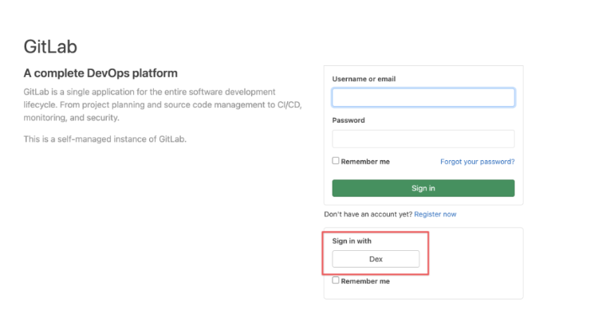

---
kind:
  - Troubleshooting
products:
  - Alauda Container Platform
  - Alauda DevOps
  - Alauda AI
  - Alauda Application Services
  - Alauda Service Mesh
  - Alauda Developer Portal
ProductsVersion:
  - 4.1.0,4.2.x
---
<!-- A type of document that involves encountering a fault, diagnosing it, performing root cause analysis, and providing solutions. -->

# GitLab 打开 SSO 问题

通过 dex 登录遇到 500 错误码

## Cause
- 平台访问地址未使用域名形式
- 域名证书不合法

## Resolution
- 设置平台的访问地址为域名模式
- 配置合法的域名证书
- 更新 gitlab 所在集群的 cluster 资源 annotation: cpaas.io/platform-url: <https://publicIP:443>

## [workaround]

## [Related Information]
**Screenshots**

- Environment: 3.10.X, 3.8.X
- cpaas.io/platform-url
- gitlab
- dex
- cluster 资源 annotation
- Component: gitlab
- Page ID: 140813658
- Original Title: GitLab 打开 SSO 问题 - 通过 dex 登录遇到 500 错误码
