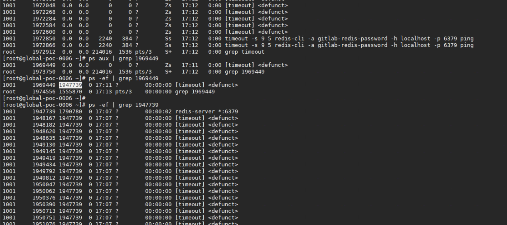
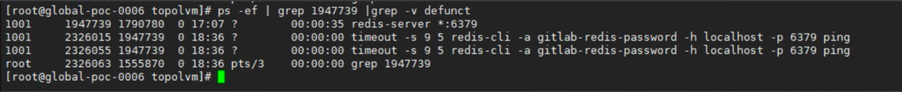
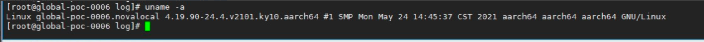
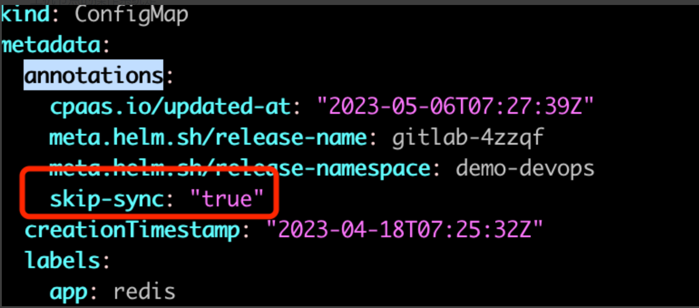

---
kind:
  - Troubleshooting
products:
  - Alauda Container Platform
  - Alauda DevOps
  - Alauda AI
  - Alauda Application Services
  - Alauda Service Mesh
  - Alauda Developer Portal
ProductsVersion:
  - 4.1.0,4.2.x
---
<!-- A type of document that involves encountering a fault, diagnosing it, performing root cause analysis, and providing solutions. -->

# 3.12

gitlab-redis生成大量僵尸进程 redis容器日志出现'useradd: command not found' chown: /data: Operation not permitted错误

## Cause
- timeout -s 9 5命令发送SIGKILL信号导致子进程无法清理
- 健康检查脚本未正确处理SIGKILL信号

## Resolution
- kubectl get cm -A|grep redis-health
- kubectl edit cm gitlab-4zzqf-redis-health -n demo-devops
- 删除脚本中的'timeout -s 9 $1 \'段落
- 在ConfigMap annotations添加'skip-sync: "true"'
- 重启redis pod

## [workaround]

## [Related Information]
**Screenshots**

- Environment: 3.12
- redis-health ConfigMap
- gitlab-4zzqf-redis-health
- demo-devops命名空间
- /opt/bitnami/scripts/start-scripts/start-master.sh
- Component: gitlab
- Page ID: 152658048
- Original Title: 3.12-gitlab-redis导致节点禅生大量僵尸进程。
