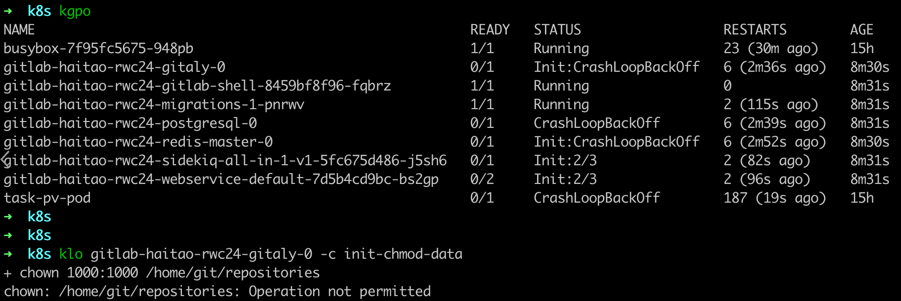
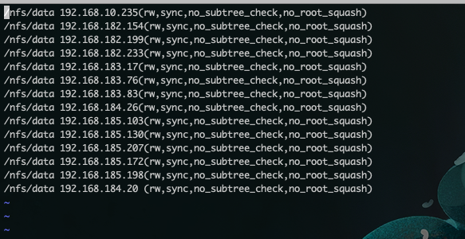

---
kind:
  - Troubleshooting
products:
  - Alauda Container Platform
  - Alauda DevOps
  - Alauda AI
  - Alauda Application Services
  - Alauda Service Mesh
  - Alauda Developer Portal
ProductsVersion:
  - 4.1.0,4.2.x
---
<!-- A type of document that involves encountering a fault, diagnosing it, performing root cause analysis, and providing solutions. -->

# gitlab部署失败initContainer初始化失败

initContainer报错: chown: /home/git/repositories: Operation not permitted

## Cause
- nfs server端缺少no_root_squash权限配置

## Resolution
- 在nfs server端/etc/exports文件添加no_root_squash配置，执行systemctl restart nfs

## [workaround]

## [Related Information]
**Screenshots**

- Environment: 通用
- /home/git/repositories
- nfs server
- /etc/exports
- no_root_squash
- initContainer
- Component: gitlab
- Page ID: 164996926
- Original Title: gitlab部署失败initContainer初始化失败
