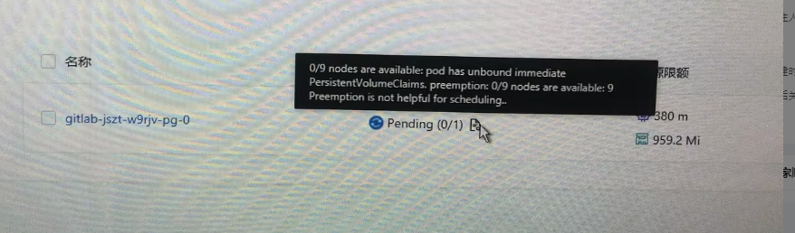
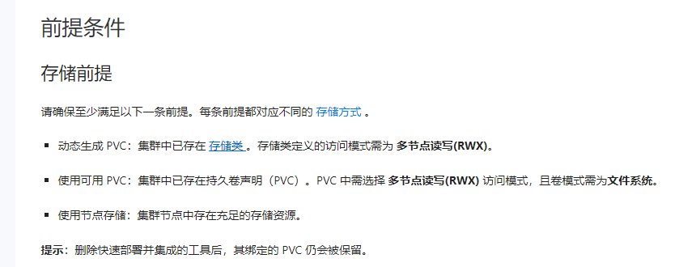
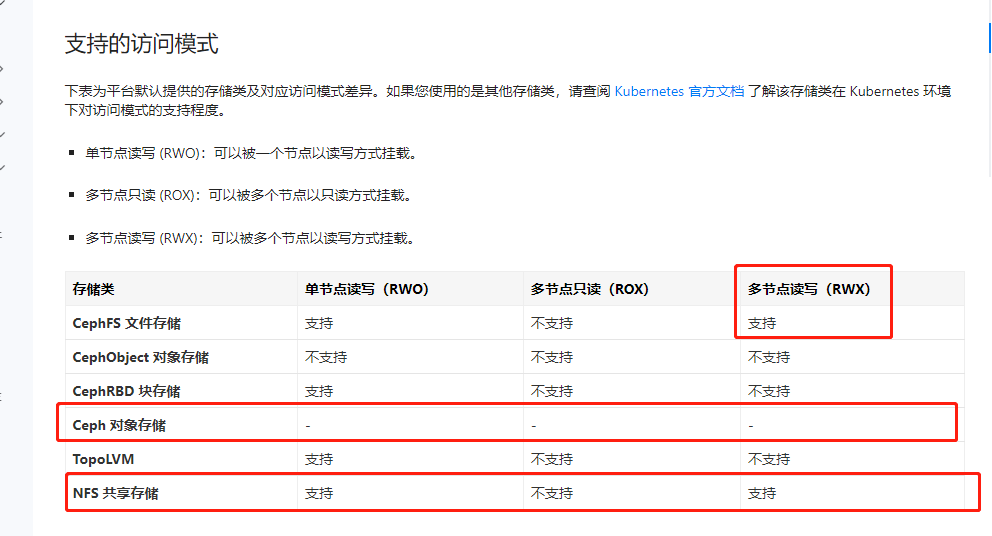

---
kind:
  - Troubleshooting
products:
  - Alauda Container Platform
  - Alauda DevOps
  - Alauda AI
  - Alauda Application Services
  - Alauda Service Mesh
  - Alauda Developer Portal
ProductsVersion:
  - 4.1.0,4.2.x
---
<!-- A type of document that involves encountering a fault, diagnosing it, performing root cause analysis, and providing solutions. -->

# 3.14.1 gitlab高可用部署pvc挂载失败

pgsql pod启动不起来 pvc挂载失败

## Cause
- 使用了topolvm块存储导致访问模式不兼容
- 存储类不支持多节点读写(RWX)

## Resolution
- 更换支持多节点读写的存储类
- 手动创建符合部署文档要求的PVC

## [workaround]

## [Related Information]
**Screenshots**

- Environment: 3.14.1
- pvc
- pgsql
- 存储类
- topolvm
- nfs
- 访问模式
- Component: gitlab
- Page ID: 182452443
- Original Title: 3.14.1 gitlab高可用部署pvc挂载失败
