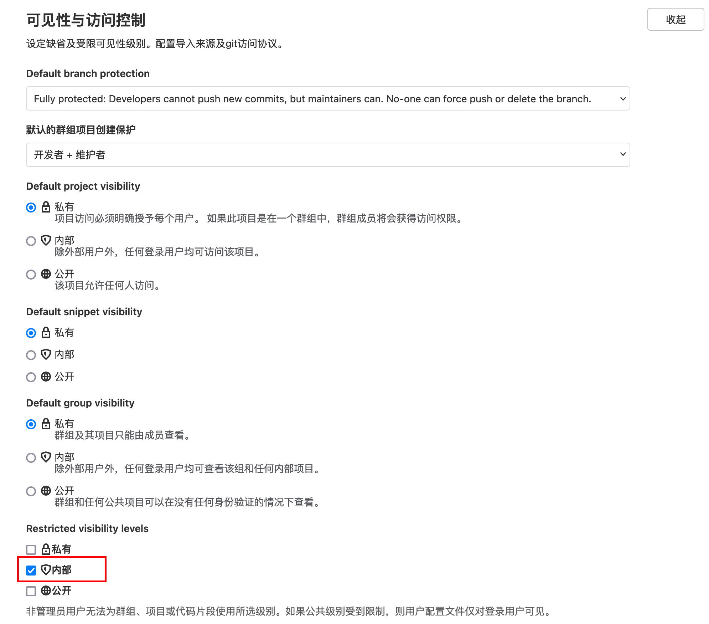
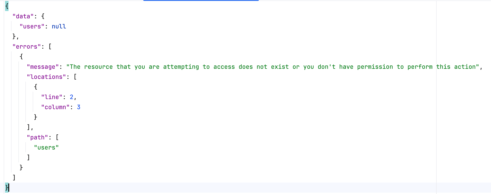

---
kind:
  - Troubleshooting
products:
  - Alauda Container Platform
  - Alauda DevOps
  - Alauda AI
  - Alauda Application Services
  - Alauda Service Mesh
  - Alauda Developer Portal
ProductsVersion:
  - 4.1.0,4.2.x
---
<!-- A type of document that involves encountering a fault, diagnosing it, performing root cause analysis, and providing solutions. -->

# GitLab Graphql邮箱信息泄露漏洞

Graphql接口可能返回用户列表信息 未授权用户可能获取用户信息（邮箱已屏蔽）

## Cause
- GitLab Graphql接口存在信息泄露漏洞（CVE-2022-0735/CVE-2021-4191）

## Resolution
- 进入管理中心->通用设置页面，展开可见性与访问控制，将Restricted visibility levels设置为内部并保存

## [workaround]

## [Related Information]
**Screenshots**

- Environment: GitLab 3.10.2（官方确认该版本不受漏洞影响）
- GitLab Graphql
- /admin/application_settings/general
- Restricted visibility levels
- Component: gitlab
- Page ID: 210438474
- Original Title: Devops-GitLab Graphql邮箱信息泄露漏洞
