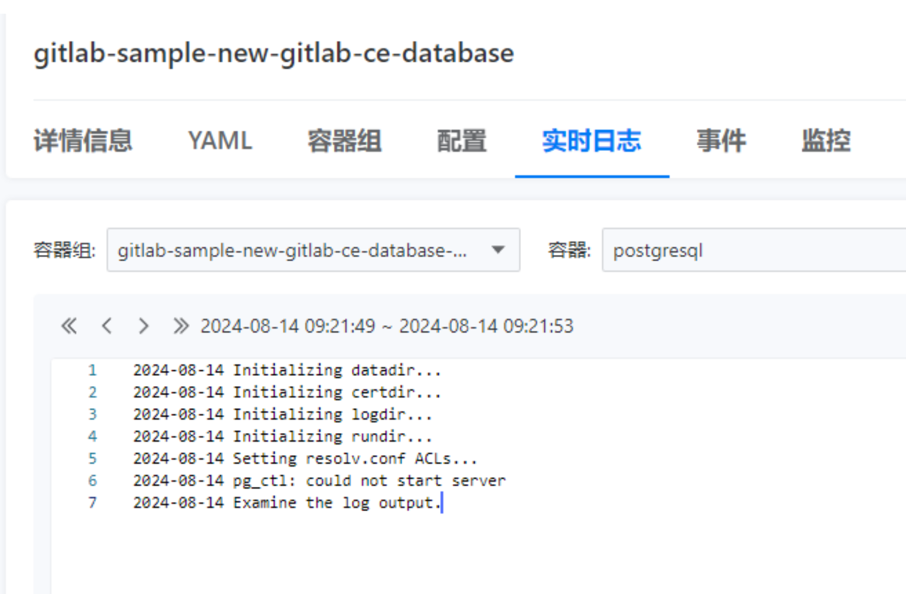
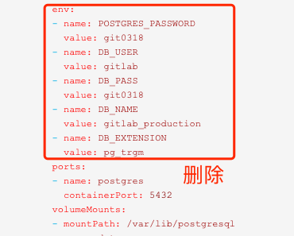

---
kind:
  - Troubleshooting
products:
  - Alauda Container Platform
  - Alauda DevOps
  - Alauda AI
  - Alauda Application Services
  - Alauda Service Mesh
  - Alauda Developer Portal
ProductsVersion:
  - 4.1.0,4.2.x
---
<!-- A type of document that involves encountering a fault, diagnosing it, performing root cause analysis, and providing solutions. -->

# gitlab起不来

gitlab database报错日志：pg_ctl: could not start server 手动执行pg进程报错：PANIC: could not locate a valid checkpoint record

## Cause
- PostgreSQL检查点记录损坏或丢失导致数据库无法启动

## Resolution
- kubectl -n operators annotate deployment gitlab-sample-new-gitlab-ce-database skip-sync="true"
- kubectl -n operators edit deployment gitlab-sample-new-gitlab-ce-database，在主容器添加command字段：["sleep", "1d"]
- 执行pg_resetwal [pg数据目录位置]
- 删除步骤1、2的配置并重启gitlab database
- 若报错ERROR: tuple already updated by self，删除gitlab database yaml中env字段的gitlab用户密码变量

## [workaround]

## [Related Information]
**Screenshots**

- Environment: 3.12.3
- pg数据目录位置
- gitlab用户密码环境变量
- gitlab-sample-new-gitlab-ce-database
- pg_resetwal
- Component: gitlab
- Page ID: 229836987
- Original Title: Devops-gitlab起不来
