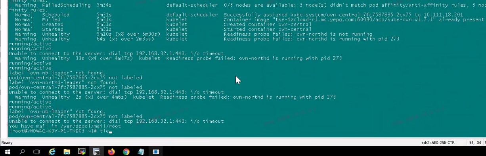
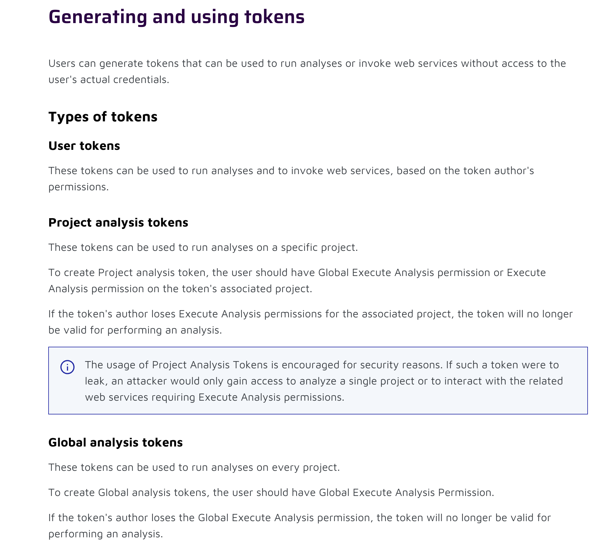

---
kind:
  - Troubleshooting
products:
  - Alauda Container Platform
  - Alauda DevOps
  - Alauda AI
  - Alauda Application Services
  - Alauda Service Mesh
  - Alauda Developer Portal
ProductsVersion:
  - 4.1.0,4.2.x
---
<!-- A type of document that involves encountering a fault, diagnosing it, performing root cause analysis, and providing solutions. -->

# 3.18.0

代码质量分析页面无数据 API请求sonar返回403错误

## Cause
- 集成时使用了global token类型的sonarqube token

## Resolution
- 修改sonarqube集成配置，将token类型改为user token

## [workaround]

## [Related Information]
**Screenshots**

- Environment: 3.18
- sonarqube
- katanomi-api
- katanomi-plugin
- token类型配置
- Component: gitlab
- Page ID: 240834889
- Original Title: 3.18.0-DevOps > 代码管理 页面中“代码质量分析”没有数据
