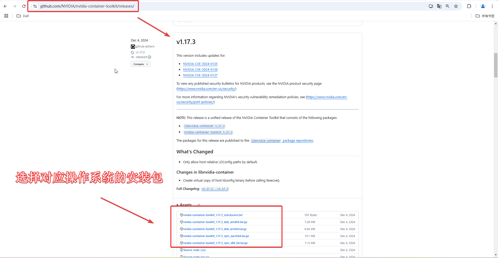
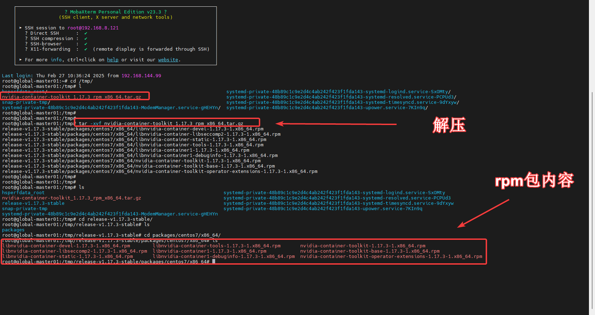
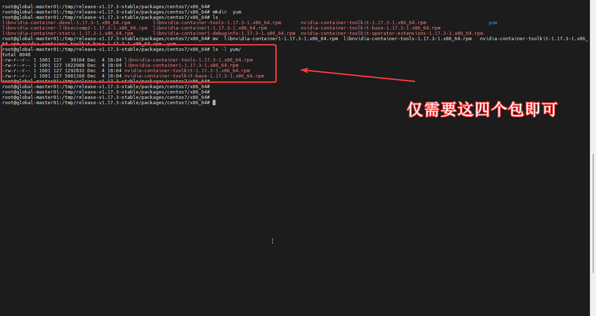

---
kind:
  - Troubleshooting
products:
  - Alauda Container Platform
  - Alauda DevOps
  - Alauda AI
  - Alauda Application Services
  - Alauda Service Mesh
  - Alauda Developer Portal
ProductsVersion:
  - 4.1.0,4.2.x
---
<!-- A type of document that involves encountering a fault, diagnosing it, performing root cause analysis, and providing solutions. -->

# Nvidia的Nvidia

无法连接外网 无法使用nvidia官方文档中推荐的源下载Nvidia-container-toolkit

## Cause
- 客户环境网络限制无法连接外网

## Resolution
- 从GitHub下载指定版本rpm包（libnvidia-container-tools/libnvidia-container1/nvidia-container-toolkit/nvidia-container-toolkit-base）后执行yum -y localinstall \*
- 使用yum install --downloadonly --downloaddir=<下载目录> nvidia-container-toolkit保存rpm包及依赖

## [workaround]

## [Related Information]
**Screenshots**

- Environment: 3.16.2
- libnvidia-container-tools
- libnvidia-container1
- nvidia-container-toolkit
- nvidia-container-toolkit-base
- yum localinstall
- yum install --downloadonly
- GitHub releases页面
- Component: gitlab
- Page ID: 266896291
- Original Title: Nvidia的Nvidia-container-toolkit 工具 rpm包下载 方式
