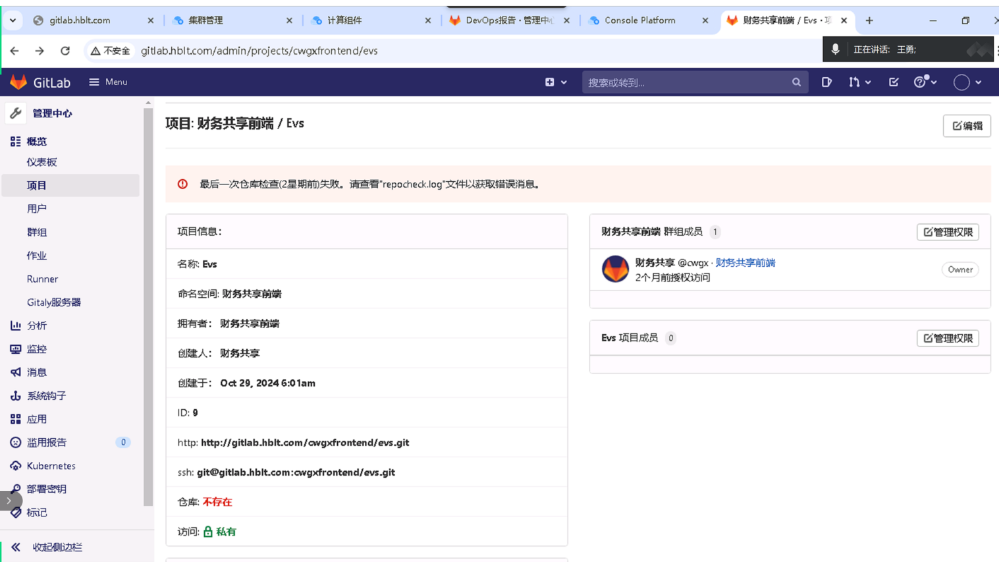

---kind:   - Troubleshootingproducts:    - Alauda Container Platform   - Alauda DevOps   - Alauda AI   - Alauda Application Services   - Alauda Service Mesh   - Alauda Developer PortalProductsVersion:   - 4.1.0,4.2.x---<!-- A type of document that involves encountering a fault, diag...it, performing root cause analysis, and providing solutions. --># gitlab项目丢失用户视图所有仓库无法访问 数据未丢失但仓库检查失败## Cause- 所有仓库的repocheck失败- 存储更换后未知原因导致状态检查异常## Resolution- 访问 Admin > Settings > Repository- 展开 Repository maintenance 版块- 执行 Clear all repository checks 操作## [workaround]## [Related Information]**Screenshots**- Environment: GitLab 3.16.1- /admin/application_settings/repository- Repository maintenance- repocheck- Component: gitlab- Page ID: 268536181- Original Title: Devops-gitlab项目丢失-98590