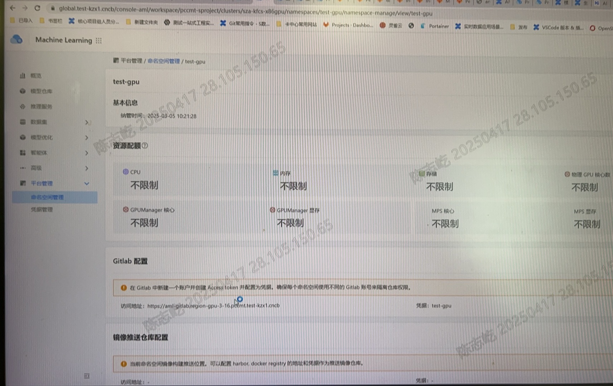

---
kind:
  - Troubleshooting
products:
  - Alauda Container Platform
  - Alauda DevOps
  - Alauda AI
  - Alauda Application Services
  - Alauda Service Mesh
  - Alauda Developer Portal
ProductsVersion:
  - 4.1.0,4.2.x
---
<!-- A type of document that involves encountering a fault, diagnosing it, performing root cause analysis, and providing solutions. -->

# 部分纳管的ns 显示没有配置 gitlab

部分纳管的ns显示没有配置gitlab

## Cause
- gitlab已存在的test-gpu group可见性设置为private，导致无法创建subgroup

## Resolution
- 将test-gpu group可见性改为public
- 删除已存在的test-gpu group让系统自动创建

## [workaround]

## [Related Information]
**Screenshots**

- Environment: GitLab
- test-gpu
- profiles-deployment
- group可见性配置
- Component: gitlab
- Page ID: 278331408
- Original Title: 部分纳管的ns 显示没有配置 gitlab
