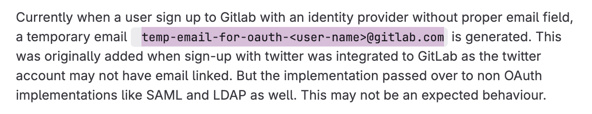

---kind:   - Troubleshootingproducts:    - Alauda Container Platform   - Alauda DevOps   - Alauda AI   - Alauda Application Services   - Alauda Service Mesh   - Alauda Developer PortalProductsVersion:   - 4.1.0,4.2.x---<!-- A type of document that involves encountering a fault, diag...it, performing root cause analysis, and providing solutions. --># 工具链里的gitlab创建新帐号后，会触发循环重定向新用户登录后跳转到http://gitlab.hblt.com/-/profile/password/new 提示重定向次数过多 使用Impersonate修改密码后仍循环重定向## Cause- 创建新用户时使用了temp-email-for-oauth-格式的邮箱## Resolution- 将用户邮箱修改为有效格式（例如用户名@ztccloud.com.cn）## [workaround]## [Related Information]**Screenshots**- Environment: GitLab 3.16.1- temp-email-for-oauth-- Impersonate功能- 用户邮箱配置- Component: gitlab- Page ID: 311558808- Original Title: Devops-工具链里的gitlab创建新帐号后，会触发循环重定向-111250