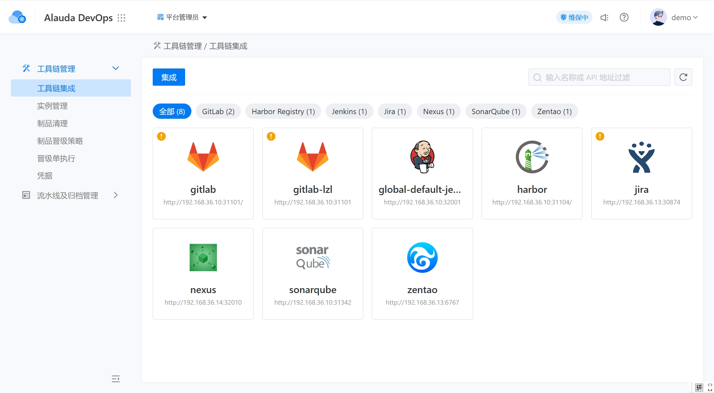

---
kind:
  - Troubleshooting
products:
  - Alauda Container Platform
  - Alauda DevOps
  - Alauda AI
  - Alauda Application Services
  - Alauda Service Mesh
  - Alauda Developer Portal
ProductsVersion:
  - 4.1.0,4.2.x
---
<!-- A type of document that involves encountering a fault, diagnosing it, performing root cause analysis, and providing solutions. -->

# demo 演示环境gitlab异常

升级时磁盘空间不足 镜像仓库异常

## Cause
- 磁盘空间不足导致升级失败

## Resolution
- 释放磁盘空间
- 重置镜像仓库
- 重新上传节点缓存镜像

## [workaround]

## [Related Information]
**Screenshots**

- Environment: 3.18.0
- 镜像仓库
- 节点缓存镜像
- 磁盘空间监控
- Component: gitlab
- Page ID: 327285256
- Original Title: Devops-工具链-Gitlab-demo 演示环境gitlab异常-114172
