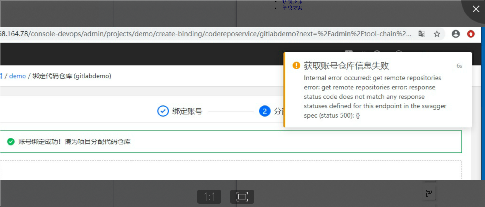
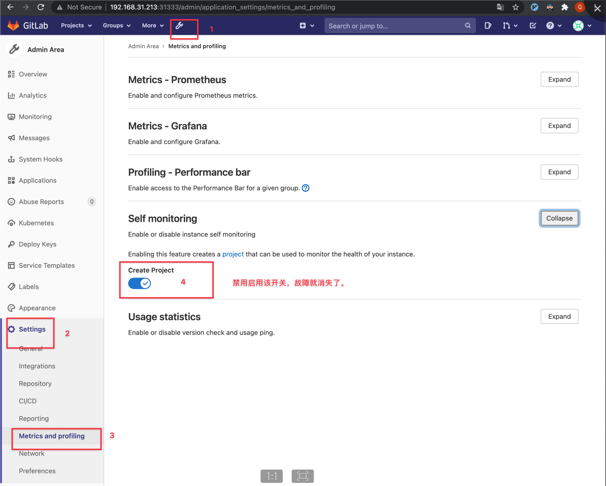

---
kind:
  - Troubleshooting
products:
  - Alauda Container Platform
  - Alauda DevOps
  - Alauda AI
  - Alauda Application Services
  - Alauda Service Mesh
  - Alauda Developer Portal
ProductsVersion:
  - 4.1.0,4.2.x
---
<!-- A type of document that involves encountering a fault, diagnosing it, performing root cause analysis, and providing solutions. -->

# gitlab分配仓库页面报错

选择分配仓库后页面右上角报错 devops-apiserver日志报错

## Cause
- gitLab社区的bug
- 当前版本没有修复

## Resolution

## [workaround]
- 禁用后再开启，再去分配仓库恢复

## [Related Information]
**Screenshots**

- Environment: TKE 3.6.x
- devops-apiserver
- gitlab账户绑定
- Component: gitlab
- Page ID: 98882602
- Original Title: gitlab分配仓库页面报错
