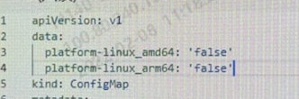
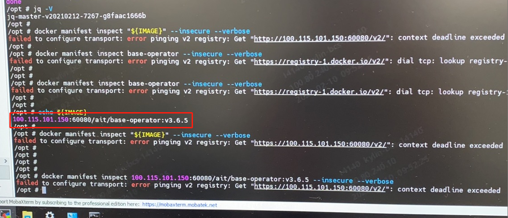

---
kind:
  - Troubleshooting
products:
  - Alauda Container Platform
  - Alauda DevOps
  - Alauda AI
  - Alauda Application Services
  - Alauda Service Mesh
  - Alauda Developer Portal
ProductsVersion:
  - 4.1.0,4.2.x
---
<!-- A type of document that involves encountering a fault, diagnosing it, performing root cause analysis, and providing solutions. -->

# 多架构环境无法添加ARM架构节点部署集群

无法添加ARM节点到集群，提示：节点可用性检查未通过，错误信息：检查系统架构为arm64不满足约束条件amd64 kube-public/configmap registry-info中data.platform-linux的amd/arm值均为false

## Cause
- base-operator无法连接60080端口镜像仓库，导致无法校验镜像架构信息

## Resolution
- 重建base-operator pod使configmap registry-info中data.platform-linux值更新为true

## [workaround]

## [Related Information]
**Screenshots**

1. 查看kube-public下configmap，registry-info中data.platform-linux amd与arm值的信息，均为false。

- Environment: ARM架构集群，ACP版本3.6.x
- kube-public/configmap registry-info
- base-operator
- 60080
- data.platform-linux
- Component: Harbor
- Page ID: 108107482
- Original Title: 多架构环境无法添加ARM架构节点部署集群
